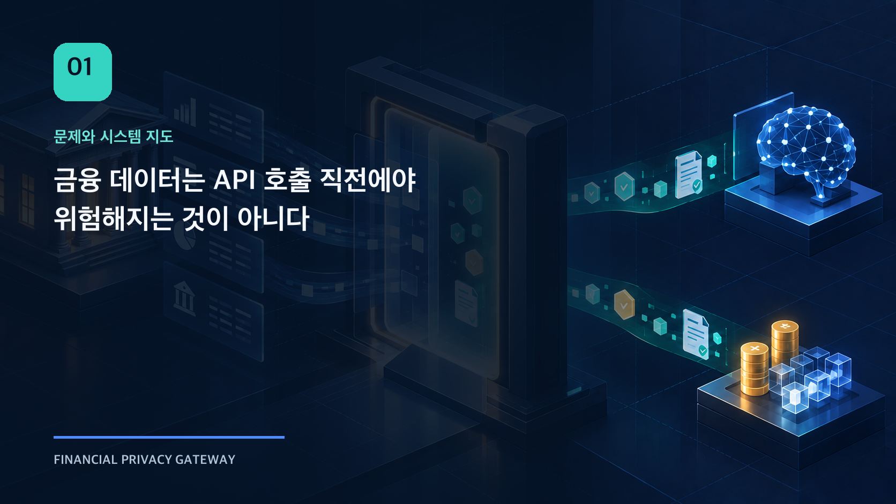
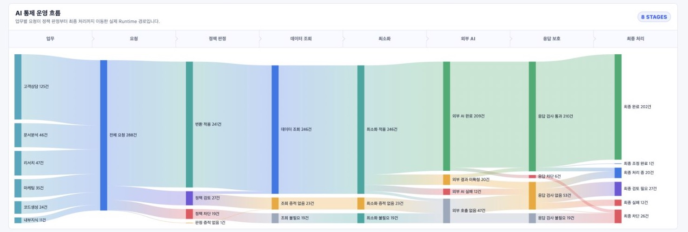
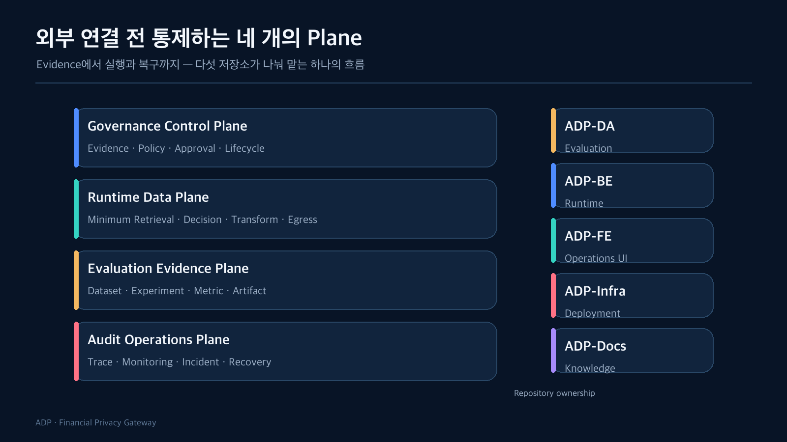

금융 데이터를 외부 AI로 전달하거나 Digital Asset 실행을 연결한다고 하면 가장 먼저 떠오르는 것은 API 연동이다. Endpoint를 정하고, 인증 정보를 넣고, 요청 DTO를 만든 뒤 응답을 받는다. 개인정보가 섞일 수 있다면 전송 직전에 마스킹 로직을 추가할 수도 있다.

하지만 실제로 어려웠던 부분은 HTTP 호출 그 자체가 아니었다. 외부로 보내도 되는 데이터인지 판단하려면 이미 다음 질문에 답할 수 있어야 했다.

- 누가 어떤 기관의 권한으로 요청했는가?
- 이 업무와 목적에서 어떤 데이터까지 조회할 수 있는가?
- 적용할 정책과 분석 근거는 어떤 버전인가?
- 원문 중 무엇을 제거하거나 변환해야 하는가?
- 호출할 외부 목적지는 서버가 승인한 곳인가?
- 전송 후 무엇을 성공으로 볼 것인가?
- 응답이 유실되면 다시 보내도 되는가?
- 이 판단을 나중에 원문 없이 설명할 수 있는가?

전송 직전에 문자열 몇 개를 가리는 방식으로는 이 질문들을 함께 다룰 수 없었다. 그래서 프로젝트의 중심을 “외부 API 연동”이 아니라 **외부 연결 전 통제 경계**로 다시 잡았다.

그 결과는 백엔드 정책 엔진 하나로 끝나지 않았다. 로컬 통합 환경에서는 운영자가 `/overview`에서 AI와 Digital Asset Pack의 상태를 구분해 보고, `/data-access`에서 업무별 조회 범위를 확인하며, `/policies`에서 후보·Shadow·승인·활성화를 처리하고, `/audit`와 `/analysis`에서 실행과 복구 Evidence를 추적한다. UI의 존재 자체보다 중요한 것은 아래 네 Plane의 책임이 실제 운영자의 확인·승인·조사 업무까지 이어졌다는 점이다.



*Local integration environment · synthetic fixture · actual BE API*

Overview는 하나의 성공률로 시스템을 요약하지 않는다. 정책 적용, 외부 실행, 응답 검사, Controlled Delivery를 서로 다른 단계로 보여주고, 단계 사이에서 줄어든 요청을 조사할 출발점으로 삼는다.

## 하나의 요청에는 네 종류의 책임이 섞여 있었다



처음에는 기능 단위로 시스템을 나누려 했다. 정책 기능, 마스킹 기능, 외부 호출 기능, 로그 기능처럼 분리하는 방식이다. 그런데 구현이 진행될수록 더 중요한 구분은 기능이 아니라 **누가 어떤 사실의 Source of Truth를 갖는가**였다.

### Governance Control Plane

Evidence, Requirement, Policy, Approval, Lifecycle을 관리한다. 분석 결과가 존재한다는 사실과 그 결과를 현재 실행 정책으로 채택한다는 결정은 다르다. 따라서 후보 정책의 생성, Shadow 비교, 승인, 활성화, 롤백을 별도 생명주기로 관리해야 했다.

### Runtime Data Plane

실제 요청을 받아 인증·인가, 최소 조회, 데이터 분류, 정책 판단, 변환, 외부 연결을 수행한다. Runtime은 요청이 들어온 순간 선택된 정책과 목적지 버전을 고정하고, 실행 도중 설정이 바뀌더라도 같은 실행 안에서는 동일한 기준을 유지한다.

### Evaluation Evidence Plane

Dataset과 실험 조건을 고정하고, Detector·Transform·모델 후보를 비교한다. 분석 결과는 Runtime 정책을 직접 변경하지 않는다. 검증된 Artifact와 명시적인 handoff contract를 통해 Governance 영역으로 전달될 뿐이다.

### Audit Operations Plane

판정, 외부 전송, 응답, 장애, 재처리, 정책 변경을 추적한다. 단순 로그 모음이 아니라 “왜 이 요청이 이 결과가 되었는가”를 execution ID, policy version, digest, reason code로 다시 연결하는 영역이다.

## 저장소를 다섯 개로 나눈 이유

저장소도 이 책임 경계를 따라 분리했다.

| 저장소 | 담당하는 사실 |
| --- | --- |
| ADP-DA | 규제·산업 Evidence, Offline 평가, versioned Artifact |
| ADP-BE | Runtime 정책 집행과 최종 Decision의 Source of Truth |
| ADP-FE | 운영자가 정책·실행·복구·감사를 해석하는 관리자 UI |
| ADP-Infra | 검증된 Cloud foundation과 배포 경계 |
| ADP-Docs | 저장소를 가로지르는 공개 개념과 운영 기준 |

중요한 점은 저장소가 곧 독립 서비스라는 뜻은 아니라는 것이다. 현재 Runtime은 Spring Boot 기반 Modular Monolith이고, Python 분석 환경과 React 관리자 UI가 별도 실행 단위로 붙는다.

실측된 장애 격리나 독립 확장 요구가 없는 기능까지 먼저 서비스로 쪼개면, 비즈니스 규칙보다 분산 트랜잭션과 계약 동기화 문제가 앞선다. 반대로 분석 코드를 Runtime 안에 넣으면 실험 의존성과 운영 정책이 섞인다. 그래서 Runtime 내부는 모듈 경계로 나누고, 분석 환경은 명확한 Artifact 계약으로 분리했다.

## 요청은 이런 순서로 흐른다

```text
공식 근거 / 분석 실험
  → Versioned Evidence와 Artifact
  → Policy Candidate / Shadow / Approval / Active Selection
  → 요청 인증·인가
  → 최소 데이터 조회와 Canonical Context
  → Policy Snapshot 고정과 Runtime Decision
  → Transform / Vault
  → Outbound Guard / 서버 소유 Destination
  → AI 또는 Digital Asset Connector
  → Response Guard / Controlled Delivery
  → Audit / Monitoring / Recovery / Reconciliation
```

이 흐름에서 뒤 단계의 성공은 앞 단계의 실패를 상쇄하지 않는다. 모델 응답 품질이 좋아도 승인되지 않은 개인정보를 보냈다면 성공이 아니다. 외부 거래가 빨리 처리됐어도 승인 금액이나 목적지가 달랐다면 성공이 아니다. API가 200을 반환했어도 외부 효과가 중복되었다면 성공이 아니다.

따라서 성공 기준도 단순 latency나 HTTP status에서 다음 질문으로 옮겨갔다.

> 같은 정책과 입력을 다시 설명할 수 있는가? 허용된 데이터만 승인된 목적지로 나갔는가? 결과가 불확실할 때 중복 실행 없이 Evidence로 수렴할 수 있는가?

## 범위를 넓히는 대신 경계를 먼저 고정했다

이 프로젝트는 WAF, API Gateway, IAM, KYC/AML 원장, Private Key Custody를 대체하지 않는다. 이 계층들을 통과한 요청에 대해 업무 목적과 데이터 범위를 다시 검증하고, 외부 실행에 필요한 semantic authorization과 evidence binding을 담당한다.

또한 현재 확인한 범위와 목표 구조를 구분한다.

- 로컬 Docker 통합 환경에서 BE, FE, DA, Docs, PostgreSQL, Mock Provider를 함께 실행한다.
- AI Evaluation과 Digital Asset 6-case는 고정된 합성 fixture로 연결을 검증한다.
- NCP에서는 VPC, subnet, ACG, Object Storage foundation과 Artifact 저장 경로 일부를 제한적으로 확인했다.
- Production Runtime 배포, HA PostgreSQL, failover, backup restore, private monitoring은 아직 운영 검증 완료로 말하지 않는다.

이 글에서 언급하는 화면과 실행 ID는 모두 local integration environment의 synthetic fixture와 실제 BE API를 사용한 결과다. 실제 고객 데이터나 실자산 운영을 뜻하지 않는다.

이 구분은 문서의 주의 문구가 아니라 아키텍처의 일부다. 검증되지 않은 기능을 정상처럼 보이게 하지 않는 UI 상태, fail-closed adapter, architecture validation도 같은 원칙에서 나왔다.

다음 글에서는 이 흐름의 출발점인 규정과 분석 결과를 살펴본다. 공식 문서의 한 문장을 왜 곧바로 `ALLOW`나 `BLOCK` 코드로 만들지 않았는지, Evidence에서 Runtime 정책까지 이어지는 계약을 따라가 본다.

## 확인한 범위

- 다섯 저장소의 현재 `main` 구조와 README
- ADP-Docs의 4-Plane 아키텍처
- ADP-BE의 Runtime, 보안, Production Reference Architecture
- 전체 로컬 Docker stack의 healthy 상태

## 아직 검증하지 않은 범위

- 실제 금융사 데이터와 상용 Provider를 사용한 운영 트래픽
- NCP Production Runtime과 HA/DR
- 법률 해석 자체의 적정성
