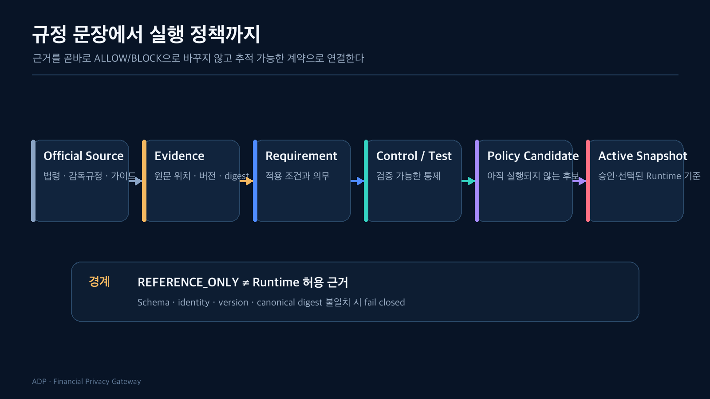

규정에서 “적절한 보호조치를 해야 한다”는 문장을 찾았다고 가정해보자. 이 문장을 `if sensitive then block` 같은 코드로 바꾸면 빠르게 통제를 만들 수 있다. 하지만 무엇이 민감한지, 어떤 업무에 적용되는지, 어떤 보호조치가 충분한지, 근거 문서가 개정되면 기존 실행을 어떻게 해석할지 답하기 어렵다.

더 큰 문제는 **분석 결과와 운영 결정의 책임이 섞이는 것**이다. 분석 단계의 후보가 곧바로 Runtime 허용 여부를 바꾸면, 실험의 불확실성이 외부 전송 결정으로 전파된다.

그래서 규정과 Runtime 사이를 하나의 값이 아니라 추적 가능한 계보로 만들었다.



## Official Source와 Evidence는 같은 것이 아니다

Official Source는 법령, 감독규정, 가이드처럼 외부에서 발행된 원문이다. Evidence는 그 원문 전체를 복제한 것이 아니라, 어떤 버전의 어느 위치를 어떤 관점에서 검토했는지 나타내는 versioned record다.

Evidence에는 최소한 다음 정보가 필요했다.

- canonical evidence ID와 version
- 공식 출처와 문서 위치
- 검토된 시점과 유효 기간
- bounded claim summary
- source digest와 content digest
- 관련 workload와 processing context
- 분석 상태와 review 상태

원문 전체를 Runtime DB에 넣지 않은 이유도 여기에 있다. Runtime이 Notebook이나 Markdown을 직접 읽기 시작하면 분석 저장소의 구조가 운영 계약이 되고, 문서 표현의 작은 변경까지 실행 결과에 영향을 줄 수 있다. BE는 신뢰한 JSON Schema와 canonical digest를 검증한 bounded artifact만 받아들인다.

## Evidence를 Requirement와 Control로 분해했다

Evidence는 근거이지 실행 명령이 아니다. 같은 근거라도 업무 목적과 데이터 종류에 따라 다른 통제가 필요할 수 있다.

```text
Evidence
  → Requirement: 무엇을 만족해야 하는가
  → Control: 시스템이 무엇을 강제해야 하는가
  → Test: 그 통제가 실제로 지켜지는지 어떻게 확인하는가
  → Policy Candidate: 특정 workload에 적용할 후보
```

예를 들어 외부 AI 처리에 관한 근거가 있다고 해서 모든 AI 요청을 막는 정책이 바로 나오지는 않는다. 데이터 분류, 처리 목적, 외부 사업자, transform 적용 여부, 응답 재검사 같은 조건을 분리해야 한다.

이 구조 덕분에 “어떤 규정 때문에 막혔다”는 모호한 설명 대신 다음 계보를 남길 수 있다.

```text
official source version
→ evidence ID/version
→ requirement refs
→ control refs
→ policy artifact/version
→ runtime snapshot digest
→ execution decision
```

## `REFERENCE_ONLY`는 허용 근거가 아니다

관리자 화면에서 조회할 수 있는 Reference Evidence에는 `REFERENCE_ONLY` 상태를 사용한다. 이 값은 공식 근거와 분석 위치를 제품에서 추적할 수 있다는 의미다. 해당 요청을 허용해도 된다는 뜻이 아니다.

이 구분을 두지 않으면 두 가지 위험이 생긴다.

첫째, 아직 검토되지 않은 분석 결과가 Runtime 정책처럼 보일 수 있다. 둘째, 과거 Evidence가 갱신되었을 때 이미 완료된 실행의 의미가 뒤늦게 바뀔 수 있다.

따라서 기존 Runtime Snapshot은 나중에 들어온 Evidence로 재해석하지 않는다. 새 Evidence가 새로운 Policy Candidate를 만들 수는 있지만, 별도의 검토와 lifecycle을 통과해야 한다.

## 분석 disposition과 Runtime action을 분리했다

분석 Artifact에는 다음과 같은 값이 존재할 수 있다.

- `candidate_handoff`
- `requires_evaluation`
- `hold`
- `reject`
- `no_runtime_action`

이 값들은 분석과 handoff의 상태다. Runtime의 `ALLOW`, `TRANSFORM`, `REVIEW`, `BLOCK`과 의미가 다르다.

예를 들어 `candidate_handoff`를 `ALLOW`로 해석하면 “개발팀이 검토할 후보”가 “외부 전송 허용”으로 바뀐다. 그래서 BE는 DA Artifact identity를 reference로 보존하되, BE가 소유한 normalizer와 applicability evaluation을 통해 별도의 `PolicyAction`을 만든다.

## Digest는 파일 무결성만 확인하지 않는다

Artifact ingest 단계에서는 JSON Schema 검증만으로 충분하지 않았다. 각각의 파일 형식이 맞더라도 서로 다른 버전의 파일을 섞으면 의미가 달라질 수 있기 때문이다.

Digital Asset bundle을 예로 들면 manifest, policy evaluation, runtime pipeline, crosswalk, binding은 서로의 ID와 version을 참조한다. Loader는 다음을 확인한다.

1. unknown field와 schema version
2. 파일별 content digest
3. bundle manifest의 파일 목록과 개수
4. cross-artifact identity와 scope binding
5. canonical JSON digest
6. 같은 identity가 다른 내용으로 덮어써지는지 여부

형식은 맞지만 의미가 연결되지 않으면 fail closed한다. 같은 identity와 같은 digest의 재전달만 idempotent replay로 인정한다.

## Evidence refresh도 자동 활성화하지 않는다

공식 근거가 갱신되면 Reference Evidence와 requirement-control lineage를 새 버전으로 만들 수 있다. 하지만 refresh가 완료되었다고 기존 ACTIVE 정책을 자동으로 교체하지 않는다.

관리자는 다음을 구분해서 보게 된다.

- 새 Evidence가 수집되었는가?
- 기존 Policy Artifact와 연결되었는가?
- Requirement와 Control이 materialized 되었는가?
- 변경된 근거가 현재 정책에 영향을 주는가?
- 새로운 후보를 만들고 Shadow 비교해야 하는가?

이 과정에서 FE는 법률 적용 여부를 추론하지 않는다. BE가 반환한 exact `requirementRefs`, `controlRefs`, lifecycle stage, source digest를 표시할 뿐이다.

## 결국 필요한 것은 “정답”보다 변경 이력이다

규정과 기술 사이에는 해석이 들어간다. 이 해석을 없앨 수는 없다. 대신 누가 어떤 근거와 분석으로 어떤 통제를 만들었는지, 그 결과가 어떤 정책 버전으로 실행되었는지 추적할 수는 있다.

이 설계의 핵심은 규정 문장을 완벽하게 자동화하는 것이 아니다. **불확실한 분석 결과가 조용히 운영 결정으로 바뀌지 않게 하는 것**이다.

다음 글에서는 이 Policy Artifact가 실제 요청을 만났을 때 어떤 일이 일어나는지 본다. 같은 `ALLOW` 후보라도 호출자와 업무 목적이 다르면 최종 결과가 더 엄격해질 수 있는 이유를 요청 한 건의 흐름으로 따라간다.

## 확인한 범위

- DA Evidence ontology와 Gateway rule artifact
- Reference Evidence bundle의 schema/digest 검증
- regulatory refresh와 requirement-control lineage 저장
- FE에서 추론 없이 exact reference를 표시하는 계약

## 아직 검증하지 않은 범위

- 법률 자문을 대체하는 자동 적용 판단
- 모든 규제 Source의 완전한 수집과 최신성 보장
- Evidence 변경만으로 정책을 자동 생성·활성화하는 기능
