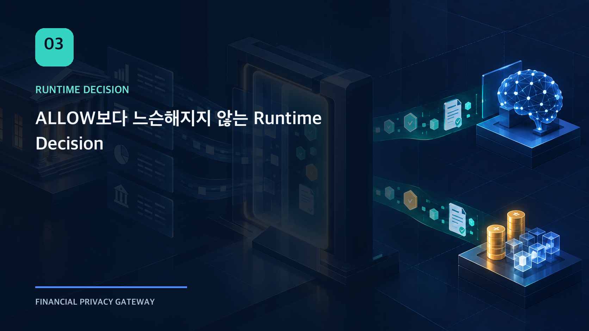
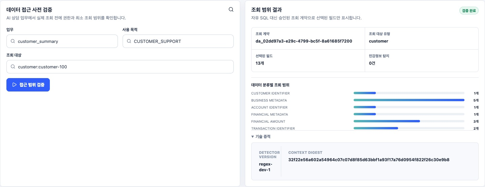
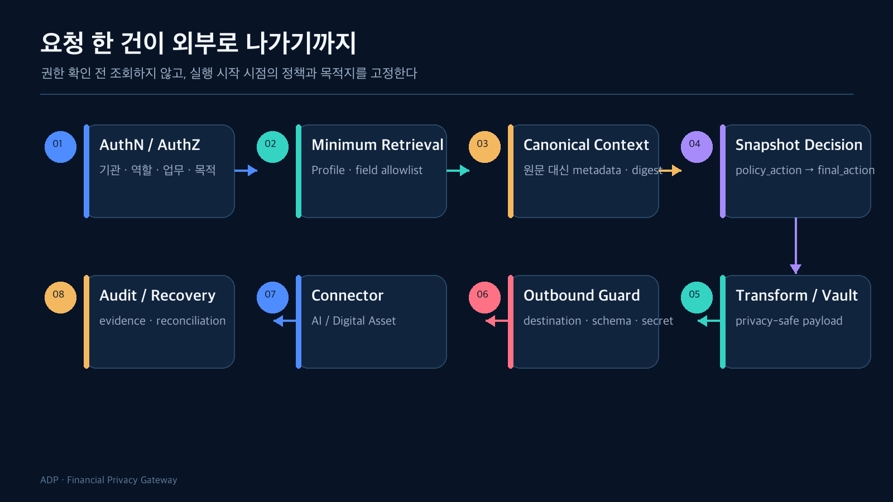

정책 파일에 `ALLOW`가 적혀 있다고 해서 요청을 바로 외부로 보내도 될까? 같은 업무라도 호출 기관, 사용자 권한, 처리 목적, 대상 고객, 데이터 종류가 다르다. 정책이 적용되는 조건이 불완전하거나 현재 요청과 맞지 않을 수도 있다.

그래서 `ALLOW`는 최종 결과가 아니라 정책 계층의 입력 중 하나로 다뤘다. 최종 실행은 요청 시점의 권한과 applicability를 함께 평가하고, 원래 정책보다 느슨해질 수 없게 만들었다.

2편에서 본 `customer_summary` 요청을 계속 따라가 보자. 목적은 `CUSTOMER_SUPPORT`, 대상은 합성 고객 한 명, 목적지는 서버가 등록한 AI profile이다. 호출자가 원하는 모든 고객 정보를 넘기는 대신, 이 workload에 연결된 조회 계약과 현재 ACTIVE snapshot이 허용하는 Field만 다음 단계로 이동한다.



*Local integration environment · synthetic fixture · actual BE API*

Data Access 화면은 원문 Record를 보여주지 않는다. 승인된 조회 계약 ID, 선택된 Field 수와 Data Class별 범위, 민감정보 탐지 결과, detector version과 canonical context digest만 표시한다. 운영자는 어떤 조회 계약이 적용됐는지 확인할 수 있지만 자유 SQL이나 원문 고객정보를 화면에서 다시 구성할 수 없다.



## 권한 확인 전에는 조회하지 않는다

Runtime API가 요청을 받으면 가장 먼저 기관과 Principal의 관계를 확인한다.

- Principal이 활성 상태인가?
- 요청한 institution과 Principal의 institution이 같은가?
- 해당 workload와 purpose를 실행할 권한이 있는가?
- subject scope가 허용되는가?
- 이 action에 필요한 role이 있는가?

이 검증이 통과하기 전에는 Retrieval Profile이나 Destination Profile을 읽지 않고, connector도 호출하지 않는다. Deny 결과는 별도의 raw-free evidence로 남긴다.

이 순서는 성능 최적화가 아니라 보안 불변조건이다. 권한이 없는 요청이 데이터의 존재 여부나 목적지 설정을 간접적으로 알아내는 것도 막아야 하기 때문이다.

## 자유 SQL 대신 Retrieval Profile을 사용했다

요청자가 조회 조건이나 SQL을 직접 전달하도록 하면, 정책 판단 전에 데이터 범위가 넓어질 수 있다. Runtime은 등록된 workload에 연결된 Retrieval Profile만 사용한다.

Profile은 다음을 고정한다.

- 허용 Dataset
- 조회 가능한 Field allowlist
- Runtime Data Class
- subject binding
- 기간 제한
- row limit

허용 Field가 하나도 없는 Dataset은 `SELECT *`로 조회한 뒤 버리는 것이 아니라 조회 자체를 생략한다. Audit에는 원문 row가 아니라 dataset, field, data class, row count, subject digest만 남긴다.

## Canonical Context에서 원문과 판단 입력을 분리했다

조회 결과를 곧바로 정책 엔진에 넘기면 DB column과 정책 규칙이 강하게 결합한다. 그래서 Canonical Context를 중간 경계로 두었다.

각 Context Field는 다음 정보를 가진다.

- canonical field name
- Runtime Data Class
- source dataset과 field lineage
- value 존재 여부
- value digest
- transform 필요 여부

API 응답과 Audit에는 원문 value를 노출하지 않는다. 하지만 어떤 값이 판단에 사용되었는지는 digest와 lineage로 연결할 수 있다.

## Policy Snapshot을 실행 시작 시점에 고정한다

정책은 실행 도중에도 바뀔 수 있다. 요청이 시작된 뒤 ACTIVE 선택이 교체되면, 판단과 외부 전송이 서로 다른 버전을 사용할 수 있다.

이를 막기 위해 실행별로 다음 identity를 고정한다.

```text
policy_version
snapshot_digest
effective_at
source_artifact_id / version / digest
runtime_context_digest
```

Digital Asset Pack은 여기에 approved policy, destination profile, runtime control, crosswalk의 version과 digest를 묶은 별도 Runtime Snapshot을 저장한다. Replay와 Recovery도 이 snapshot을 다시 선택하지 않고 기존 것을 재사용한다.

## `policy_action`과 `final_action`은 다른 값이다

`policy_action`은 선택된 정책이 요청에 대해 내린 1차 판단이다. `final_action`은 authorization과 applicability, Runtime guard까지 반영한 집행 결과다.

| Policy Action | 허용되는 Final Action |
| --- | --- |
| `BLOCK` | `BLOCK` |
| `REVIEW` | `REVIEW`, `BLOCK` |
| `TRANSFORM` | `TRANSFORM`, `REVIEW`, `BLOCK` |
| `ALLOW` | `ALLOW`, `TRANSFORM`, `REVIEW`, `BLOCK` |

이 관계를 monotonic decision이라 부른다. Runtime은 정책을 더 엄격하게 만들 수는 있지만 완화할 수 없다.

예를 들어 정책이 `ALLOW`여도 다음 상황에서는 결과가 달라진다.

- 호출자 권한 부족 → `BLOCK`
- Runtime Data Class mapping 불완전 → `REVIEW`
- 해당 Provider에는 가명처리가 필요 → `TRANSFORM`
- workload 또는 purpose 불일치 → `BLOCK` 또는 `REVIEW`

반대로 정책이 `BLOCK`인데 Runtime 조건이 좋아졌다는 이유로 `ALLOW`할 수는 없다.

## 미매칭을 허용으로 해석하지 않는다

정책 엔진에서 가장 위험한 기본값은 “규칙을 찾지 못했으니 허용”이다. 다음 상태는 모두 명시적인 비허용 결과로 다룬다.

- rule 미매칭
- 서로 충돌하는 rule
- unknown data class
- 필요한 processing context 누락
- workload/purpose binding 불일치
- policy snapshot 또는 destination profile 누락

특히 `NOT_APPLICABLE`과 `INCOMPLETE`를 구분한다. 적용 대상이 아니라는 사실과 적용 여부를 판단할 정보가 부족하다는 사실은 운영 의미가 다르다. 정보가 부족한 상태를 `NOT_APPLICABLE`로 처리하면 사실상 우회 경로가 된다.

## 이 단계에서는 “누가 무엇을 조회할 수 있는가”에 집중한다

동일 요청 replay와 body hash 충돌도 Runtime 계약에 포함되지만, 이 주제는 외부 효과와 복구를 다루는 6편에서 자세히 본다. 여기서 더 중요한 경계는 Authorization이 Retrieval보다 앞서고, 자유 SQL이 아니라 등록된 조회 계약이 데이터 범위를 결정하며, 그 결과가 Policy Snapshot과 함께 Decision Trace에 남는다는 점이다.

## Trace는 로그 목록이 아니라 단계별 계약이다

한 실행의 Trace에는 `RECEIVED`, `AUTHORIZATION`, `RETRIEVAL`, `CANONICAL_CONTEXT`, `DECISION`, `TRANSFORM`, `OUTBOUND_GUARD`, `CONNECTOR`, `RESPONSE_GUARD` 같은 stage가 순서대로 남는다.

운영자는 단순히 실패 stack trace를 보는 대신 다음을 연결할 수 있다.

- 어떤 Principal과 scope가 사용됐는가
- 어떤 policy snapshot이 선택됐는가
- policy action과 final action이 왜 달라졌는가
- 어떤 transform과 guard가 적용됐는가
- connector와 controlled delivery가 어떤 상태인가

다음 글에서는 이 흐름 중 Transform과 Egress를 확대한다. 개인정보를 가리는 알고리즘보다, 원문이 어느 경계에서도 다시 살아나지 않게 하는 것이 왜 더 중요한지 살펴본다.

## 확인한 범위

- Authorization 이후에만 Retrieval과 idempotency reservation을 수행하는 Runtime 순서
- Retrieval Profile과 field allowlist
- Policy/Final Action 단조성
- Snapshot pinning과 Runtime trace persistence
- 동일 key의 다른 body 충돌

## 아직 검증하지 않은 범위

- 모든 업무에 대한 실운영 Retrieval Profile
- 외부 Identity Provider와 mTLS Service Identity
- 장기간 실행되는 분산 workflow의 snapshot 전파
