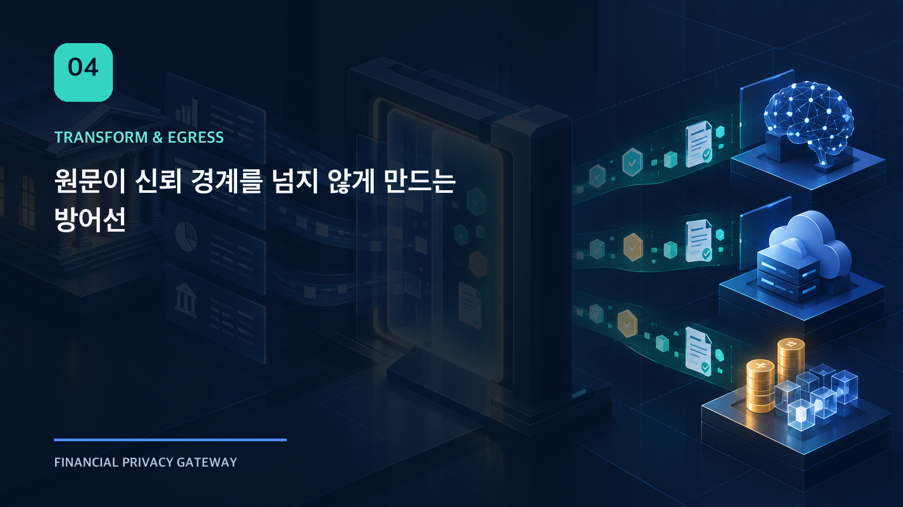
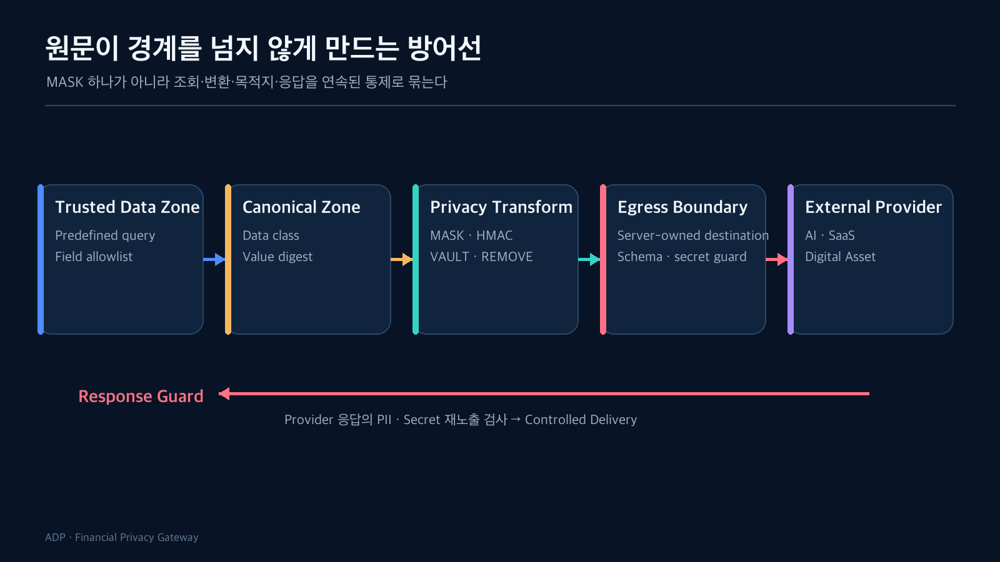

개인정보 보호 기능을 설명할 때 가장 쉬운 예시는 마스킹이다. 계좌번호 일부를 `****`로 바꾸면 화면에서도 변화가 보이고 구현도 직관적이다. 하지만 외부 연결 시스템에서 마스킹 함수 하나만으로는 부족했다.

원문은 조회 단계, Context 조립, 정책 판단, 변환, 로그, 외부 payload, Provider 응답, 관리자 화면 중 어느 곳에서도 다시 노출될 수 있다. 따라서 문제를 “어떤 알고리즘으로 가릴까”가 아니라 **원문이 신뢰 경계를 넘지 않게 어떻게 연속된 방어선을 만들까**로 바꿨다.



## 첫 번째 보호조치는 Transform이 아니라 최소 조회다

조회하지 않은 데이터는 유출할 수도 없다. Runtime은 workload별 Retrieval Profile과 Field allowlist를 통해 필요한 열만 조회한다.

이 방식은 `SELECT *` 이후 DTO에서 필드를 제거하는 것과 다르다. 후자는 application memory, ORM log, exception, debug tool에서 원문이 노출될 가능성을 남긴다. 최소 조회는 데이터가 애플리케이션 경계에 들어오는 시점부터 범위를 줄인다.

## Canonical Context에는 판단에 필요한 형태만 남긴다

조회 결과는 Canonical Context로 바뀐다. 외부 API schema에 바로 맞추지 않는 이유는 내부 데이터 구조와 Provider 계약을 분리하기 위해서다.

예를 들어 고객 식별자라는 동일한 의미도 DB column, AI prompt field, Digital Asset customer reference에서 표현이 다르다. Canonical Context는 의미와 data class, source lineage를 고정하고 실제 외부 형식은 뒤의 schema mapper가 담당한다.

Audit와 Trace에는 원문 대신 digest를 남긴다. 동일 값이 사용됐는지 비교할 수 있지만 원문을 복원하는 저장소가 되지는 않는다.

## Transform 전략은 목적에 따라 달라진다

현재 Runtime에는 다음 전략의 baseline이 있다.

| 전략 | 목적 | 주의점 |
| --- | --- | --- |
| `MASK` | 사람이 일부 형식을 알아볼 필요가 있을 때 | 동일성 비교가 어렵고 남은 문자가 식별 단서가 될 수 있음 |
| `HMAC_PSEUDO` | 같은 scope에서 동일성을 비교할 때 | key version과 scope가 반드시 Evidence에 남아야 함 |
| `VAULT_TOKEN` | 원문과 token mapping을 별도 경계에서 관리할 때 | Vault lifecycle과 접근 통제가 필요함 |
| `REMOVE` | 외부 처리에 필요하지 않은 field 제거 | downstream schema가 optional field를 처리해야 함 |
| `KEEP` | 정책상 명시적으로 허용된 값 유지 | 기본 전략으로 사용하면 안 됨 |
| `GENERALIZE` | 금액·연령 등의 정밀도를 낮춰도 utility가 유지될 때 | bucket 경계가 분석 결과를 왜곡할 수 있음 |
| `FIELD_SEPARATION` | 원문과 파생 정보를 서로 다른 경계로 나눌 때 | 재결합 가능성과 correlation을 검토해야 함 |

전략 이름만 저장해서는 재현할 수 없다. Transform evidence에는 strategy version, parameter, key version, mapping version, source digest, transformed digest를 연결한다.

## Privacy가 높다고 항상 좋은 Transform은 아니다

분석 저장소에서는 Transform 방식별 privacy와 utility를 함께 평가한다. 원문을 모두 제거하면 보호 수준은 높아지지만, 업무가 수행되지 않을 수 있다. 반대로 utility가 높다는 이유로 원문을 유지하면 외부 전송 통제가 무의미해진다.

그래서 “최고 점수의 기법”을 전역 기본값으로 고르지 않는다. workload와 field treatment별 validated profile을 만들고, Runtime은 승인된 mapping만 사용한다.

평가에서 확인하지 못한 기법은 `NOT_EVALUABLE` 또는 unresolved 상태로 남긴다. 결과가 없다는 사실을 0점이나 실패로 바꾸지 않는 것도 중요하다.

## 외부 목적지는 요청자가 고르지 못한다

Transform을 잘했어도 payload가 임의의 URL로 나가면 통제는 무너진다. Runtime request는 외부 URL을 받지 않는다. `destinationProfileId`만 받고 서버가 등록한 profile에서 endpoint와 Provider 정보를 가져온다.

Outbound Guard는 connector 직전에 다음을 다시 검사한다.

- 선택된 destination과 approved destination이 같은가
- payload field가 allowlist 안에 있는가
- schema version이 맞는가
- secret 또는 forbidden field가 포함되지 않았는가
- transform evidence와 outbound candidate digest가 연결되는가
- request 시작 시 고정한 profile digest가 유지되는가

Guard를 policy decision 뒤에 한 번 더 두는 이유는 TOCTOU 문제 때문이다. 판단 이후 payload 조립이나 profile lookup 과정에서 값이 바뀌어도 connector 직전 경계에서 차단해야 한다.

## Provider 응답도 신뢰하지 않는다

외부로 보낼 때만 개인정보를 검사하고 응답은 그대로 전달하면, Provider가 입력값을 그대로 반사하거나 예상하지 못한 secret을 포함할 수 있다.

Response Guard는 Provider response를 별도의 신뢰하지 않는 입력으로 본다. PII reflection, secret pattern, correlation mismatch, schema mismatch를 검사하고, 통과한 결과만 Controlled Delivery로 넘긴다.

Connector가 성공해도 Response Guard가 거부하면 사용자에게 결과를 전달하지 않는다. 외부 실행 상태와 delivery 상태를 별도로 저장하는 이유다.

## 화면에서 Blur하는 것은 보안 통제가 아니다

프론트엔드에서 문자열을 받아 CSS blur를 적용하면 사용자는 값을 읽기 어렵다. 하지만 원문은 이미 브라우저에 도착했고 개발자 도구에서 확인할 수 있다.

권한이 없는 값은 BE가 다음처럼 원문 없이 응답해야 한다.

```json
{
  "displayValue": null,
  "visibility": "RESTRICTED",
  "reasonCode": "INSUFFICIENT_SCOPE"
}
```

FE의 blur placeholder는 보안 기능이 아니라 제한 상태를 전달하는 표현이다. 보안 경계는 서버 응답 이전에 끝나야 한다.

## 한 단계의 완벽함보다 경계 사이 연결이 중요했다

최소 조회, Canonical Context, Transform, Vault, Outbound Guard, Response Guard 중 하나만 강해도 충분하지 않다. 각 단계의 input과 output이 version과 digest로 연결되어야 “판단한 payload와 실제 보낸 payload가 같은가”를 확인할 수 있다.

다음 글에서는 이 공통 경계 위에 성격이 다른 AI와 Digital Asset 실행을 올린다. 어느 부분을 재사용하고, 어느 완료 조건을 Pack별로 분리했는지 비교한다.

## 확인한 범위

- 최소 조회와 field allowlist
- 7개 Transform 전략 baseline과 raw-free persistence
- 서버 소유 Destination Profile
- Outbound/Response Guard와 Controlled Delivery
- FE가 권한 제한 원문을 받지 않는 UI 계약

## 아직 검증하지 않은 범위

- 운영 KMS/Secret Manager와 실제 Vault 연동
- 모든 workload에 대한 Transform utility 보장
- Provider별 전체 응답 schema와 공격 패턴
