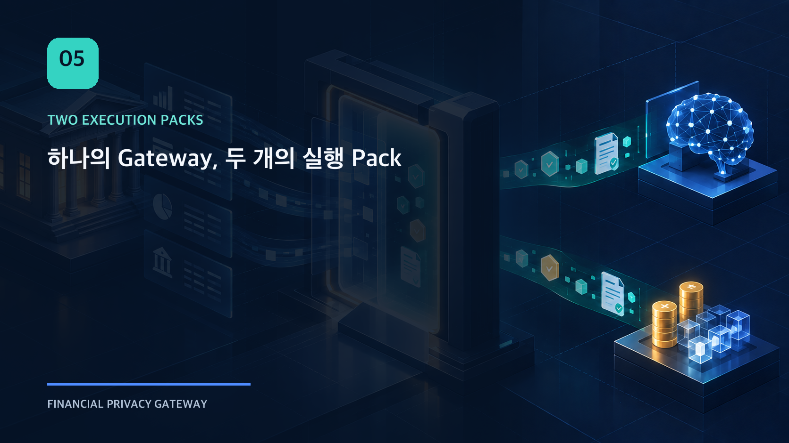
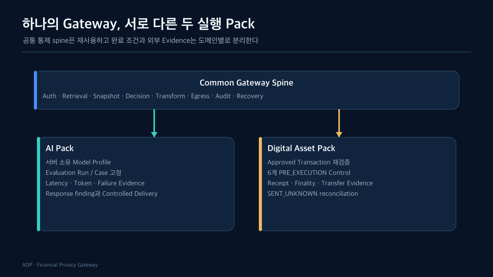
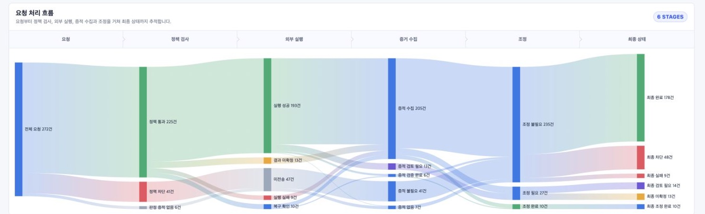
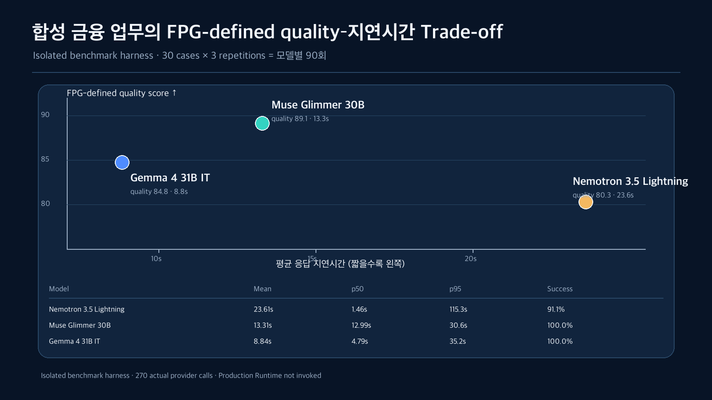
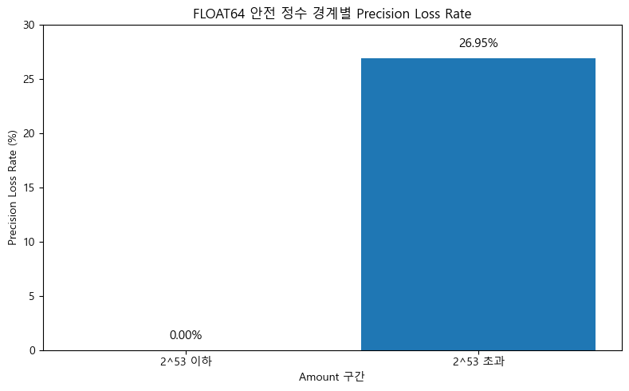
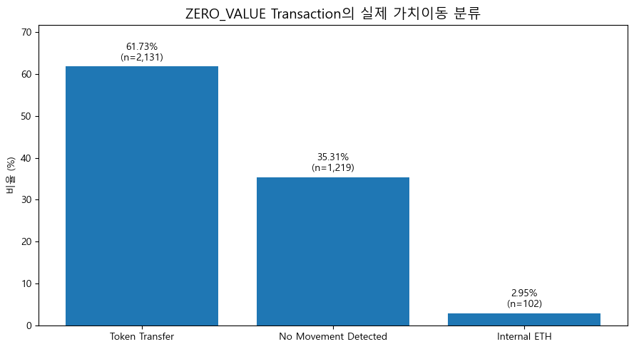
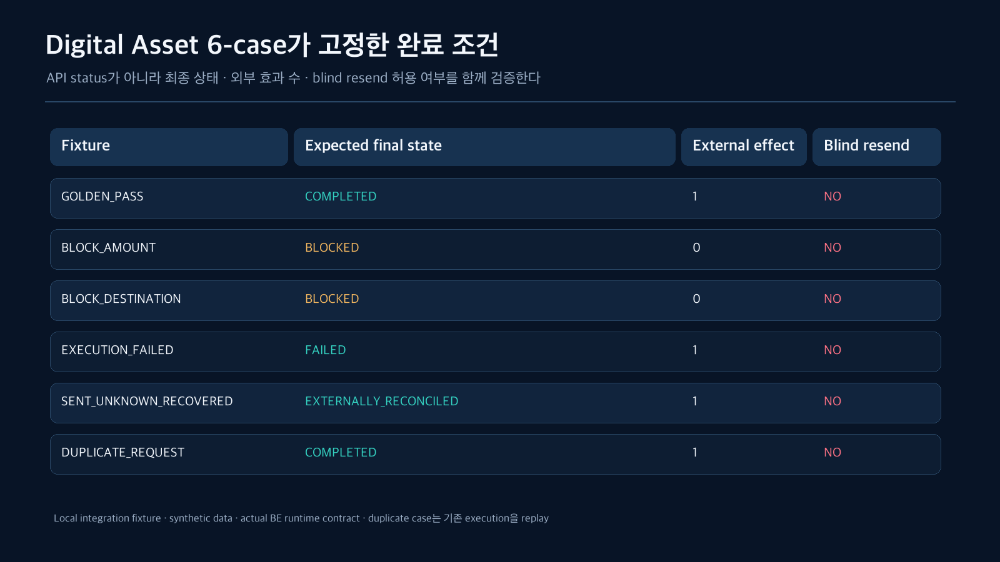

AI Provider 호출과 Digital Asset 외부 실행은 얼핏 전혀 다른 문제처럼 보인다. AI는 prompt와 model response를 다루고, Digital Asset은 승인 거래와 transaction finality를 다룬다. 둘을 하나의 추상화로 억지로 묶으면 중요한 도메인 의미가 사라질 수 있다.

반대로 인증, 최소 조회, 정책 선택, 개인정보 변환, 목적지 통제, 감사, 재시도 같은 공통 기능을 각각 구현하면 같은 보안 경계를 두 번 만들게 된다.

그래서 공통 Runtime을 하나의 spine으로 두고, 외부 실행의 입력·완료 조건·Evidence만 Pack별로 분리했다.



## 공통화한 것은 기술이 아니라 통제 순서다

두 Pack은 모두 다음 순서를 공유한다.

```text
Authentication / Authorization
→ Minimum Retrieval
→ Canonical Context
→ Policy Snapshot / Runtime Decision
→ Transform / Vault
→ Destination Profile / Outbound Guard
→ Pack Connector
→ Response or Post-execution Guard
→ Audit / Recovery
```

공통 순서를 유지하면 새 Pack을 추가할 때 인증이나 egress 통제를 우회하는 별도 진입점이 생기는 것을 막을 수 있다. Runtime API도 `POST /v1/runtime/executions` 하나를 유지하고, 내부 resolver가 workload와 processing context를 기준으로 Pack별 port를 선택한다.

미등록 Pack이나 adapter는 일반 connector로 fallback하지 않고 fail closed한다.



*Local integration environment · synthetic fixture · actual BE API*

Digital Asset Overview는 공통 Runtime의 결과를 `요청 → 정책 검사 → 외부 실행 → 증적 수집 → 조정 → 최종 상태`로 투영한다. AI Overview의 응답 검사·Controlled Delivery 흐름과 화면 구조까지 억지로 같게 만들지 않고, 운영자가 각 Pack의 완료 조건을 그대로 읽게 했다.

## AI Pack은 실행 조건을 평가 단위로 고정한다

AI 모델 비교에서 prompt만 같다고 같은 실험이라 할 수 없다. Model profile, destination, timeout, transform scope, dataset version, evaluation case가 함께 고정되어야 한다.

AI Evaluation Run은 다음 관계를 명시한다.

- evaluation run ID와 version
- case ID와 dataset version
- 서버가 허용한 model profile
- destination profile
- policy/snapshot identity
- fixed conditions digest

Runtime request가 model ID나 임의 endpoint를 직접 전달하지 않는 이유다. 클라이언트가 모델을 바꿀 수 있으면 평가 조건과 실제 실행이 달라진다.

현재 로컬 baseline에서는 세 개의 서버 소유 NVIDIA 호환 model profile을 같은 Runtime 경로로 실행한다. Provider 호출 결과는 단순 성공/실패가 아니라 다음 Evidence로 저장한다.

- HTTP 상태와 정규화된 connector status
- end-to-end latency와 provider latency
- token usage와 수집 상태
- failure category
- response guard finding
- runtime execution, case, model의 binding

DA는 Provider를 다시 호출하지 않고 BE가 export한 evaluation bundle을 검증하고 비교할 수 있다.

아래 270회 모델 비교는 ADP-DA의 **격리된 benchmark harness**에서 수행한 실제 Provider 호출 결과다. BE Production Runtime을 통과한 270회 실행을 의미하지 않으며, 모델 평가 Evidence와 Runtime의 외부 실행 승인은 별개의 경계로 유지했다. Benchmark 실행 당시 Production governance는 fail-closed 상태였고 Production Runtime은 호출되지 않았다.



고정된 합성 금융 업무 30 case를 모델별 3회씩 실행한 270회 benchmark에서도 하나의 모델이 모든 축을 지배하지 않았다. Muse Glimmer 30B는 이번 **FPG-defined quality score**에서 가장 높은 평균값을 보였고, Gemma 4 31B IT는 평균 지연시간이 가장 짧았다. 비용은 공식 per-model trial 단가를 확인하지 못해 비교에서 제외했다. 이 결과는 모델의 보편적 순위가 아니라 **같은 실행 조건과 metric contract를 고정해야 선택 근거를 다시 검토할 수 있다**는 예시다.

평균만으로는 운영 특성이 가려졌다. Nemotron은 p50이 1.46초였지만 p95는 115.3초였고 성공률은 91.1%였다. Gemma도 평균은 8.84초지만 p95는 35.2초였다. 따라서 모델 선택 근거에는 중심값뿐 아니라 tail latency와 실패 비율을 함께 남겨야 한다.

| Model | Mean | p50 | p95 | 성공률 |
| --- | ---: | ---: | ---: | ---: |
| Nemotron 3.5 Lightning | 23.61s | 1.46s | 115.3s | 91.1% |
| Muse Glimmer 30B | 13.31s | 12.99s | 30.6s | 100.0% |
| Gemma 4 31B IT | 8.84s | 4.79s | 35.2s | 100.0% |

## AI에서 완료는 응답 수신과 같지 않다

Provider가 200을 반환해도 응답에 원문 개인정보가 반사되거나, 기대한 schema를 만족하지 않거나, evaluation case binding이 다르면 Controlled Delivery를 허용할 수 없다.

따라서 AI Pack은 다음 상태를 분리한다.

```text
Provider transport result
≠ Response Guard result
≠ Controlled Delivery result
≠ Evaluation completeness
```

모델별 실행 수가 존재해도 case×model matrix가 완전하지 않으면 bundle readiness는 `READY`가 아니다. 결과가 있는 것과 비교 가능한 결과가 있는 것은 다르다.

## Digital Asset Pack은 실행 전후의 동일성을 증명한다

Digital Asset 실행은 “응답을 잘 받았는가”보다 “승인한 거래와 실제 외부 효과가 같은가”가 중요하다.

실행 전에는 server-owned Approved Transaction과 요청을 비교한다.

- customer와 subject binding
- asset
- network
- amount와 limit
- destination / counterparty
- approval validity

Policy Gate에서 금액이나 목적지가 다르면 connector 이전에 차단한다. 이 경우 provider request, connector row, post-execution evidence가 없어야 한다. 차단됐는데 외부 효과가 한 건이라도 생겼다면 실패다.

## PRE_EXECUTION Guard를 connector 바로 앞에 다시 둔 이유

Policy Decision을 통과한 뒤에도 payload mapping 과정에서 값이 바뀔 수 있다. Digital Asset Pack은 connector 직전에 여섯 개 Runtime Control을 다시 평가하고 requested tuple과 approved tuple을 digest로 묶는다.

이 검사는 도메인 rule을 중복 구현하려는 것이 아니다. decision 시점과 실제 external call 시점 사이의 변조를 막는 TOCTOU 방어다.

## 왜 Digital Asset에는 별도의 Completion Contract가 필요한가

AI 응답의 완료 조건과 달리 Digital Asset은 승인한 값, 외부 transaction, receipt와 실제 가치 이동이 서로 맞는지 확인해야 한다. Amount exactness와 ZERO_VALUE 분석은 이 Pack의 완료 조건을 단순 HTTP status나 transaction hash로 정의할 수 없는 이유를 보여준다.

### 금액은 표시값이 아니라 실행값이다

Digital Asset에서 amount를 일반 실수형으로 다루면 승인값과 실행값이 화면에서는 같아 보여도 최소 단위에서 달라질 수 있다. DA-02는 BigQuery 원본 amount와 매칭된 73,266건을 비교했다. Decimal 기반 처리는 전체 값을 보존했지만, FLOAT64 변환에서는 3,280건의 원본 wei가 달라졌다. Positive amount 28,953건으로 범위를 좁히면 손실률은 11.33%였다.



`2^53` 이하 16,784건에서는 손실이 관측되지 않았고, 이를 초과한 12,169건 중 3,280건에서 손실이 발생했다. 이 결과는 모든 자산이나 네트워크의 손실률을 추정한 것이 아니다. 현재 표본에서 **FLOAT64 안전 정수 경계를 넘으면 exact preservation을 계약으로 보장할 수 없다**는 구조적 위험을 확인한 것이다.

그래서 Runtime은 amount를 정수 최소 단위로 보존하고, 사람이 읽는 decimal 표현과 분리한다. 승인값·요청값·실행값도 같은 canonical integer를 기준으로 비교하며, 외부 전송 과정의 FLOAT64 변환을 허용하지 않는다.

### transaction hash가 있어도 성공은 아니다

외부 시스템이 transaction hash를 반환했다고 해서 settlement가 완료됐다고 단정할 수 없다. Post-execution 단계는 서로 독립적인 resolver를 통해 다음 Evidence를 수집한다.

- transaction identity
- receipt status
- finality status
- transfer evidence
- approved/requested/executed tuple의 re-binding

receipt가 실패했거나 finality가 미확정이면 `COMPLETED`로 전환하지 않는다. amount, asset, network, destination이 다르면 mismatch로 격리하고 Controlled Delivery를 보류한다.

Transaction의 직접 `value`가 0이라는 사실도 “가치 이동 없음”을 뜻하지 않았다. DA-03의 2026년 1월 ZERO_VALUE 분석대상 3,452건을 Receipt·Trace·Token Transfer와 연결했을 때, 2,131건에서 Token Transfer, 추가 102건에서 Internal ETH Movement가 확인됐다.



분석대상 안에서는 64.69%가 별도 가치 이동 Evidence를 가졌고 3,452건 모두 Receipt와 연결됐다. 다만 이 표본은 Ethereum 전체의 단순확률표본이 아니므로 전체 거래 비율로 일반화하지 않는다. 설계에 반영한 결론은 비율 자체가 아니라 `Transaction Record ≠ Execution Result`, `Transaction Value ≠ Total Asset Movement`라는 두 경계다.

두 그래프는 DA 저장소에 보존된 실행 output을 notebook SHA-256과 cell 번호로 고정해 추출했다. 이번 문서 작업에서 원천 데이터를 다시 조회하거나 새 실험 결과를 만든 것은 아니다.

## 같은 상태 이름도 Pack마다 완료 조건이 다르다

| 경계 | AI Pack | Digital Asset Pack |
| --- | --- | --- |
| 실행 조건 | Model/Evaluation contract | Approved Transaction/Artifact snapshot |
| 외부 입력 | privacy-safe prompt/payload | canonical outbound transaction |
| 실행 전 통제 | provider·transform binding | 6개 Runtime Control |
| 실행 결과 | response, token, latency, finding | transaction, receipt, finality, transfer |
| 완료 조건 | response guard와 delivery | independent evidence와 re-binding |
| 불확실 상태 | timeout/HTTP ambiguity | `SENT_UNKNOWN`과 reconciliation |

공통 Runtime status가 같더라도 Pack outcome handler는 서로 다른 Evidence를 요구한다. 이 차이를 숨기지 않는 것이 추상화의 핵심이었다.

## 여섯 개의 Digital Asset 고정 Case

현재 로컬 제품 E2E는 DA 저장소의 versioned fixture 여섯 개를 실제 Runtime API에 통과시킨다.

| Case | 기대 결과 | 외부 효과 |
| --- | --- | --- |
| `GOLDEN_PASS` | 독립 Evidence 검증 후 `COMPLETED` | 1 |
| `BLOCK_AMOUNT` | 승인 금액 초과로 `BLOCKED` | 0 |
| `BLOCK_DESTINATION` | 목적지 불일치로 `BLOCKED` | 0 |
| `EXECUTION_FAILED` | 실패 receipt로 `FAILED` | 1 |
| `SENT_UNKNOWN_RECOVERED` | 상태 조회 후 `EXTERNALLY_RECONCILED` | 1 |
| `DUPLICATE_REQUEST` | 기존 execution replay | 1 |

각 case는 API status만 보지 않는다. PostgreSQL의 execution, provider request, connector evidence, recovery, audit lineage와 external effect count를 함께 검증한다.



`BLOCK_AMOUNT`와 `BLOCK_DESTINATION`은 connector 이전에 멈춰 외부 효과가 0이어야 한다. `EXECUTION_FAILED`는 외부 효과가 있었지만 receipt 실패로 완료가 아니며, `SENT_UNKNOWN_RECOVERED`는 새 전송 없이 기존 효과 1건을 Evidence로 수렴시킨다. `DUPLICATE_REQUEST`의 1은 두 번째 효과가 아니라 최초 execution의 replay다.

공통 Gateway를 재사용한다는 것은 두 도메인을 같은 것으로 취급한다는 뜻이 아니다. 공통화할 것은 신뢰 경계와 운영 불변조건이고, 분리할 것은 완료의 의미다.

다음 글에서는 그 차이가 가장 크게 드러나는 `SENT_UNKNOWN`을 다룬다. 외부 전송 결과를 모를 때 왜 실패 처리나 즉시 재시도 모두 위험한지 장애 타임라인으로 살펴본다.

## 확인한 범위

- 공통 Runtime API와 Pack resolver
- AI Evaluation Run/Bundle의 case×model 완전성
- 정수 최소 단위 Amount 보존과 FLOAT64 경계 분석
- Transaction·Receipt·Trace·Token Transfer 결속
- Digital Asset의 pre/post execution Evidence
- 고정된 합성 fixture 6-case 로컬 E2E

## 아직 검증하지 않은 범위

- 상용 AI Provider 전체 조합의 지속적 benchmark
- 실자산·실제 Wallet·Private Key를 사용하는 거래
- 실제 Blockchain finality provider와 custody 연동
