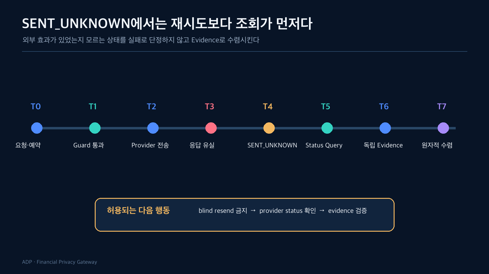
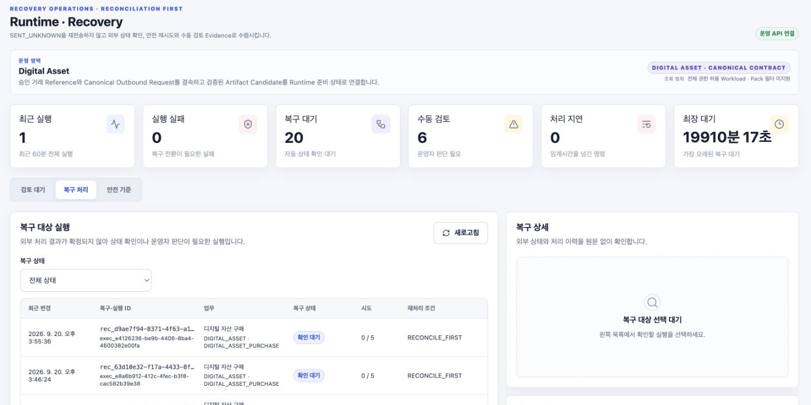
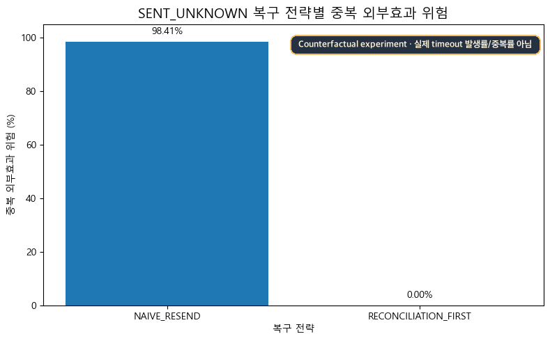

외부 API 호출에서 timeout이 발생하면 보통 재시도를 떠올린다. 조회 API라면 합리적인 선택일 수 있다. 하지만 외부 거래나 결제처럼 호출이 실제 효과를 만드는 경우에는 timeout이 실패를 뜻하지 않는다.

Provider는 요청을 처리했지만 응답만 유실했을 수 있다. 이때 같은 요청을 다시 보내면 하나의 사용자 행위가 두 개의 외부 효과로 남는다.

그래서 `SENT_UNKNOWN`은 실패가 아니라 **외부 전송은 시도했지만 결과를 확정할 Evidence가 부족한 상태**로 정의했다.



## T0. Idempotency namespace를 먼저 고정한다

Idempotency key는 전역 문자열이 아니다. Institution과 workload가 namespace를 소유한다.

```text
namespace = institution + workload + idempotency_key
identity  = canonical_request_hash
```

같은 namespace와 key가 들어오면 request hash를 비교한다. body까지 같을 때만 기존 execution을 replay한다. 금액, 목적지, subject, approval, evaluation reference 중 하나라도 다르면 충돌이다.

이 검사는 중복 요청을 줄이는 최적화가 아니라, 하나의 key가 서로 다른 외부 효과를 가리키지 못하게 하는 계약이다.

## T1. 외부 호출 직전까지는 다시 계산하지 않는다

요청이 시작되면 policy, artifact, destination, control, crosswalk의 version과 digest가 snapshot에 고정된다. Recovery 시점에 현재 ACTIVE 정책을 다시 선택하면 과거 실행의 의미가 바뀔 수 있다.

따라서 retry나 reconciliation도 원래 execution에 고정된 snapshot과 provider correlation key를 사용한다.

## T2. Provider-visible correlation을 함께 보낸다

서버 내부 execution ID만으로는 외부 상태를 조회할 수 없다. Provider가 인식할 correlation key를 outbound request에 포함하고, connector evidence와 recovery job에 같은 값을 저장한다.

이 값도 사용자가 임의로 제공한 식별자를 그대로 쓰지 않는다. Institution과 execution scope에 결속된 서버 소유 값을 사용한다.

## T3. 응답 유실을 `FAILED`로 저장하지 않는다

TCP 연결 종료, client timeout, upstream timeout은 외부 처리 결과를 설명하지 못한다. 그래서 connector result를 다음처럼 분리한다.

- `NOT_SENT`: 외부로 보내지 않았다는 근거가 있음
- `ACKNOWLEDGED`: Provider가 요청을 수신·처리했다는 근거가 있음
- `FAILED`: 외부 실패를 확정할 typed result가 있음
- `SENT_UNKNOWN`: 전송 가능성은 있으나 결과를 확정할 수 없음

`SENT_UNKNOWN`을 `FAILED`로 축약하면 운영자가 안전하게 재시도할 수 있다고 오해한다.

정책 판단을 통과했더라도 connector 결과가 `SENT_UNKNOWN`이면 delivery는 `WITHHELD`로 남긴다. 정책 허용과 외부 결과 전달 가능 여부를 분리한 것이다.

## T4. Recovery queue도 업무 상태와 분리한다

불확실한 외부 실행은 recovery job으로 등록한다. Job에는 attempt, next retry time, lease owner, lease expiry, retry disposition, last evidence를 저장한다.

여러 worker가 같은 incident를 동시에 처리하지 않도록 PostgreSQL의 claim/lease와 `SKIP LOCKED`를 사용한다. Worker는 terminal update 직전에 lease ownership을 다시 CAS로 확인한다. 오래된 worker가 늦게 돌아와 최신 결과를 덮어쓰는 것을 막기 위해서다.



*Local integration environment · synthetic fixture · actual BE API*

Recovery 화면은 최근 실행과 실행 실패를 구분하고, 복구 대기·수동 검토·처리 지연·최장 대기 시간을 별도 운영 신호로 보여준다. 성공률 하나로 불확실 상태를 감추지 않고, 목록에서 사건을 선택해야만 원문 없는 처리 이력과 재처리 조건을 확인할 수 있다.

## T5. Status Query가 재전송보다 먼저다

`SENT_UNKNOWN`의 기본 disposition은 `RECONCILE_FIRST`다.

```text
SENT_UNKNOWN
  → provider status query
  → 외부에서 NOT_SENT가 확인됨
      → 정책이 허용할 때만 safe retry 후보
  → 외부 효과가 확인됨
      → independent evidence 검증
  → 여전히 불명확
      → backoff / manual review / exhausted
```

단순히 “조회 API를 한 번 호출한다”가 아니다. 조회 결과가 원래 request correlation과 연결되는지, terminal 상태인지, 독립 Evidence가 completion-safe한지 검증한다.



DA-06은 Ethereum master sample 73,410건에 `외부 제출 뒤 응답이 유실됐다`는 counterfactual을 적용했다. 73,410건 모두 transaction hash와 receipt를 연결할 수 있었고, 그중 이미 성공한 72,241건을 실패로 간주해 즉시 재전송하면 중복 효과 위험이 생겼다. 반대로 `RECONCILIATION_FIRST`는 기존 transaction을 먼저 조회하도록 정의했기 때문에 즉시 재전송과 중복 효과가 0이었다.

이 수치는 실제 네트워크 timeout 발생률이나 운영 환경의 중복률이 아니다. 이미 관측된 transaction에 두 복구 정책을 적용한 구조적 비교다. 그래서 핵심 결론도 “98.41%만큼 성능이 좋아졌다”가 아니라 `UNKNOWN ≠ FAILED`와 `Retry Before Reconciliation 금지`다.

## T6. Digital Asset은 독립 Evidence가 있어야 수렴한다

Digital Asset status adapter는 transaction status만 `SUCCESS`라고 반환해서는 부족하다. transaction, receipt, finality, transfer evidence를 다시 구성하고 approved/requested/executed tuple을 비교한다.

Evidence adapter가 누락됐거나 결과가 모호하면 Runtime을 성공 상태로 수렴시키지 않는다. Provider 자기 보고만으로 완료를 선언하지 않기 위해서다. Audit에도 connector status, response guard, controlled delivery, recovery status를 별도 필드로 저장하며, status query evidence가 없다는 사실을 빈 성공값으로 바꾸지 않는다.

## T7. 상태 전환은 원자적이어야 한다

Reconciliation이 성공하면 다음 상태들이 함께 바뀌어야 한다.

- recovery job
- connector interaction
- pack-specific execution evidence
- Runtime execution status
- audit/trace event

중간 저장에서 하나라도 실패하면 전체 변경을 rollback한다. Recovery row만 완료됐는데 Runtime은 여전히 불확실하거나, Runtime만 성공인데 independent evidence가 없는 상태를 남기지 않는다.

## 재시도가 가능한 경우도 좁게 정의했다

안전한 재시도는 다음 조건을 모두 만족할 때만 후보가 된다.

- Status Query 결과 외부 요청이 `NOT_SENT`임을 확인
- 원래 snapshot과 request hash가 유지됨
- retry policy의 attempt와 시간 범위 안에 있음
- connector가 해당 operation의 retry capability를 명시함
- 수동 또는 scheduler가 유효한 lease를 획득함

그 외에는 `MANUAL_REVIEW` 또는 `EXHAUSTED`로 수렴한다. 자동화가 더 이상 안전하지 않다는 사실을 상태로 표현하는 것이다.

## 성공 기준은 응답 수가 아니라 외부 효과 수다

중복 요청 테스트에서 중요한 assertion은 200 응답 개수가 아니다.

```text
runtime execution count = 1
provider request count = 1
connector evidence count = 1
external effect count = 1
replayed execution id = original execution id
```

복구 테스트도 마찬가지다. `SENT_UNKNOWN`이 사라졌는지만 보는 것이 아니라, blind resend가 없었는지와 기존 snapshot digest가 유지됐는지를 확인한다.

다음 글에서는 이 실행 기준을 만드는 정책이 어떻게 승인되고 교체되는지 본다. 정책 배포를 코드 배포와 분리하자 왜 Shadow Evidence, Maker-Checker, optimistic revision이 필요했는지 살펴본다.

## 확인한 범위

- Institution/workload idempotency namespace와 request hash
- `SENT_UNKNOWN → RECONCILE_FIRST` 계약
- PostgreSQL claim/lease와 stale worker 차단
- Digital Asset local status query와 independent evidence 수렴
- 동일 요청 replay 시 additional external effect 0

## 아직 검증하지 않은 범위

- 실제 Provider별 Status/Retry adapter
- 장기 장애에서의 운영 SLA와 on-call 절차
- Multi-region recovery와 network partition
