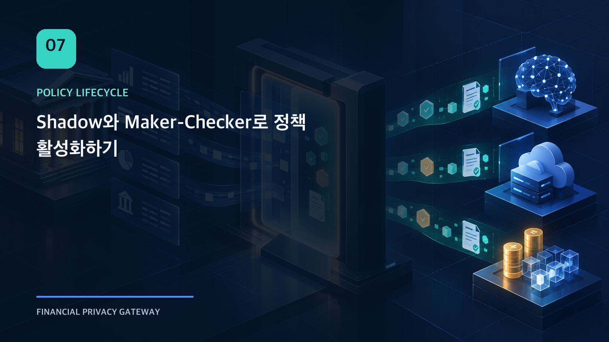
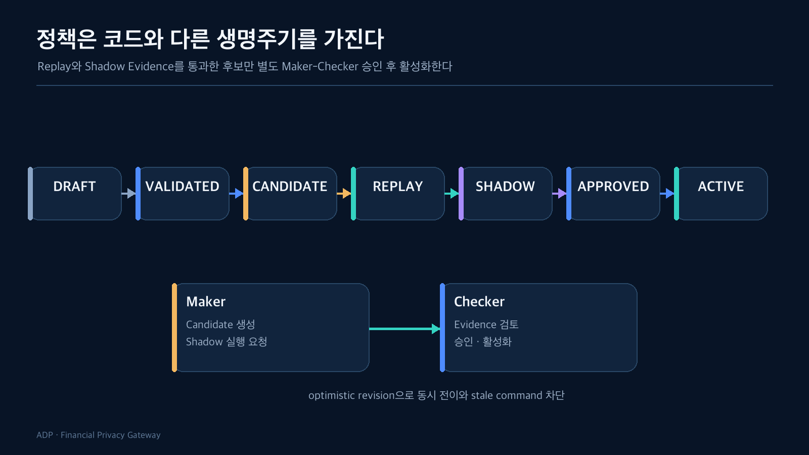

초기 구현에서는 정책 fixture가 코드와 함께 배포됐다. 구조는 단순했지만 정책을 바꾸려면 애플리케이션을 다시 빌드해야 했고, 코드 rollback과 정책 rollback의 의미도 섞였다.

정책을 데이터로 분리한다고 문제가 끝나지는 않았다. 새 JSON 파일을 업로드하는 기능만 만들면 검증되지 않은 후보가 즉시 실행 경로에 들어갈 수 있다. 누가 만들고 누가 승인했는지, 기존 ACTIVE와 어떤 차이가 있는지, 동시 요청 중 어떤 버전이 선택됐는지도 관리해야 했다.

그래서 정책에 코드와 다른 생명주기를 만들었다.



## 상태 이름보다 허용되는 전이가 중요하다

Lifecycle은 다음 흐름을 따른다.

```text
DRAFT
→ VALIDATED
→ CANDIDATE
→ REPLAY
→ SHADOW
→ APPROVED
→ ACTIVE
→ SUPERSEDED
```

각 상태는 라벨이 아니라 수행된 Evidence를 의미한다.

- `VALIDATED`: schema와 semantic validation 통과
- `CANDIDATE`: 적용 scope가 정해진 검토 후보
- `REPLAY`: 고정된 evaluation case로 재실행 가능
- `SHADOW`: 현재 ACTIVE와 부수 효과 없이 비교
- `APPROVED`: 별도 Checker가 Shadow Evidence를 검토
- `ACTIVE`: scope의 Current Selection으로 선택
- `SUPERSEDED`: 다른 버전으로 교체됐지만 rollback target으로 보존

중간 단계를 건너뛰는 전이는 서버에서 거부한다. FE 버튼을 숨기는 것만으로는 통제가 되지 않는다.

## Shadow는 두 정책을 같은 입력에서 비교한다

Candidate와 ACTIVE baseline을 비교하려면 input이 같아야 한다. Shadow request는 임의 payload를 받지 않고 서버가 등록한 evaluation case ID를 사용한다.

Evaluator는 다음 identity가 같은지 확인한다.

- evaluation case ID와 version
- input digest
- workload와 purpose
- baseline/candidate artifact identity
- evaluator version

비교 결과는 raw output 대신 typed diff로 남는다.

- baseline action
- candidate action
- final action
- reason code 차이
- required control 차이
- digest와 assertion source

Shadow 경로에서는 connector나 외부 action을 호출하지 않는다. 비교를 위해 실제 효과를 만들면 검증 자체가 위험해지기 때문이다.

## Shadow MATCH만으로 승인하지 않는다

기계적 비교가 `MATCH`라고 해도 자동으로 `APPROVED`로 바꾸지 않는다. Candidate를 만든 사람과 승인하는 사람을 분리한다.

Maker-Checker가 필요한 이유는 단순한 2인 결재가 아니다.

- Candidate 작성자가 자신의 가정을 스스로 승인하지 않게 한다.
- Shadow case가 충분한지 사람이 확인한다.
- Evidence의 scope와 version을 다시 검토한다.
- 운영 영향과 rollout 시점을 결정한다.

승인 요청에는 “통과했다”는 boolean이 아니라 BE가 발급한 Shadow Evaluation ID를 전달한다. 서버는 해당 Evidence가 최신 Candidate와 현재 baseline에 결속되어 있는지 다시 확인한다.

## 활성화도 상태 변경과 선택을 분리한다

Artifact가 `ACTIVE`라는 사실과 특정 scope에서 현재 선택됐다는 사실을 하나의 row에 넣으면 rollback 이력을 설명하기 어렵다.

그래서 Current Selection을 별도 모델로 둔다.

```text
scope = institution + pack + workload + purpose
selection = artifact_id + version + digest + revision
```

새 정책을 활성화하면 기존 ACTIVE는 `SUPERSEDED`가 되고 selection revision이 증가한다. Runtime은 요청 시작 시 current selection을 읽어 immutable snapshot으로 고정한다.

## Optimistic revision이 막는 사고

두 운영자가 같은 revision을 보고 서로 다른 Candidate를 동시에 활성화할 수 있다. 마지막 write가 조용히 이기는 방식은 정책 변경에 적합하지 않다.

활성화와 rollback 요청에는 화면에서 조회한 artifact revision과 selection revision을 함께 보낸다. DB의 현재 revision과 다르면 stale command로 거부한다.

이 방식은 lock을 오래 잡지 않으면서도 운영자가 오래된 화면을 기준으로 정책을 덮어쓰는 것을 막는다.

## Policy rollback은 Application rollback이 아니다

문제가 생겼을 때 애플리케이션 image를 이전 버전으로 돌리는 것과 정책 선택을 이전 Artifact로 바꾸는 것은 서로 다른 작업이다.

- Application rollback: 실행 코드와 dependency를 이전 immutable image로 전환
- Policy rollback: 이전 `SUPERSEDED` Artifact를 Current Selection으로 다시 선택
- DB migration: 이미 적용한 additive migration은 되돌리거나 수정하지 않음

정책 문제에 application rollback을 사용하면 이미 실행된 요청의 snapshot과 현재 selection을 설명하기 어려워진다. 반대로 코드 호환성 문제가 있는데 정책만 되돌려도 해결되지 않는다.

## 모든 전이는 append-only Evidence를 남긴다

현재 상태만 저장하면 누가 어떤 근거로 활성화했는지 사라진다. Lifecycle transition과 Current Selection 변경은 append-only event로 남긴다.

운영 화면은 이 event와 현재 projection을 함께 사용한다.

- 현재 artifact와 revision
- 직전 transition reason
- Maker와 Checker
- Shadow Evidence identity
- activation/rollback history
- scope와 pack

Metric은 운영 추세를 보여주지만 Source of Truth는 DB event다. Transaction이 commit된 뒤에만 counter를 증가시켜 rollback된 변경을 성공 metric으로 기록하지 않는다.

정책을 코드에서 분리한 결과 변경 속도는 빨라졌지만, 그만큼 상태·권한·Evidence가 필요해졌다. 데이터로 옮겼다는 사실보다 **안전하게 바꿀 수 있는 운영 모델을 함께 만들었는가**가 더 중요했다.

마지막 글에서는 전체 프로젝트의 검증 범위를 정리한다. 자동 테스트 수보다 중요한 것은 어떤 환경에서 무엇을 확인했고, 무엇은 아직 설계에 머물러 있는지 구분하는 일이었다.

## 확인한 범위

- Lifecycle 단방향 전이와 revision fencing
- 동일 case/input 기반 Shadow evaluation
- Shadow Evidence-bound Maker-Checker 승인
- Current Selection 활성화와 이전 버전 rollback
- append-only transition/selection event

## 아직 검증하지 않은 범위

- 실제 조직의 승인 정책과 변경관리 프로세스
- 대규모 multi-tenant policy catalog
- 점진 rollout과 자동 rollback 정책
