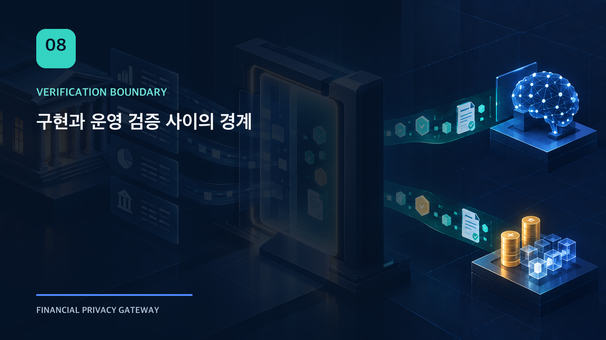
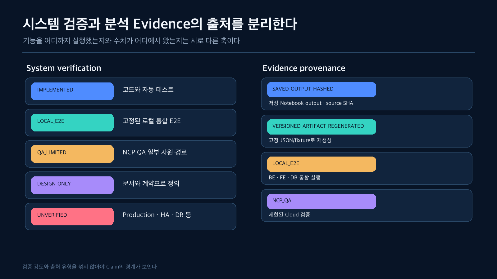
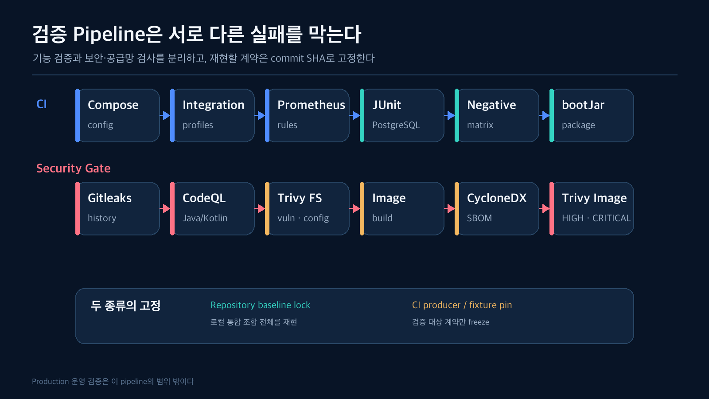
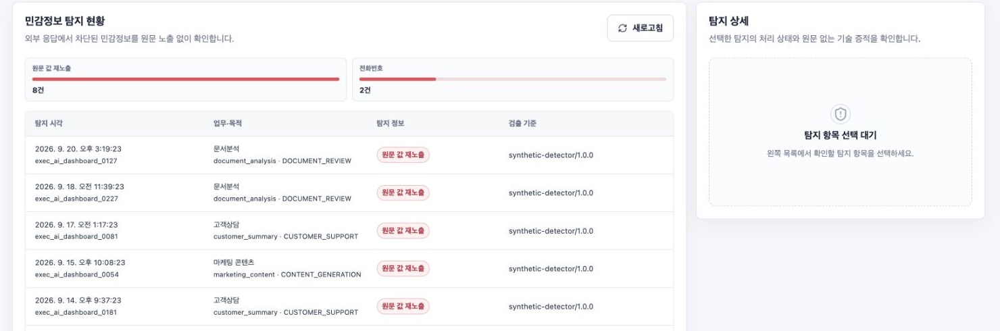

이 프로젝트를 정리하면서 가장 쉬운 마무리는 기능 수와 테스트 수를 나열하는 것이었다. 실제로 2026-09-20, ADP-BE `10333d4` 기준 `@Test` 검색 결과는 539개였다. 하지만 이 숫자는 코드가 바뀌면 바로 달라지고, 무엇을 어디에서 검증했는지는 설명하지 못한다.

단위 테스트가 많아도 실제 저장소 버전이 맞지 않을 수 있고, 로컬 E2E가 성공해도 Production HA를 검증한 것은 아니다. Cloud resource가 존재해도 Runtime이 그 위에서 정상 동작한다고 단정할 수 없다.

그래서 기능 목록보다 먼저 **시스템 검증 등급**과 **분석 Evidence provenance**를 나눴다.



## 구현과 검증은 같은 문장이 아니다

| 등급 | 의미 | 사용하는 표현 |
| --- | --- | --- |
| `IMPLEMENTED` | main 코드와 자동 테스트가 존재 | 구현했다 |
| `LOCAL_E2E` | 고정된 로컬 통합 환경에서 E2E 확인 | 로컬 통합 환경에서 검증했다 |
| `QA_LIMITED` | NCP QA의 특정 자원·경로만 확인 | 해당 범위에서 제한적으로 검증했다 |
| `DESIGN_ONLY` | 문서와 계약만 존재 | 목표 구조로 설계했다 |
| `UNVERIFIED` | 실행 Evidence가 없음 | 아직 검증하지 않았다 |

이 구분이 없으면 `docker compose`에서 동작한 기능이 어느 순간 “운영 검증 완료”로 표현된다. 시스템의 약점을 숨기는 것이 아니라, 다음 검증 작업의 위치를 잃게 된다.

하지만 시스템 검증 등급만으로는 분석 수치의 출처를 설명할 수 없었다. 저장된 Notebook output, 버전이 고정된 JSON, 실제 로컬 통합 실행을 모두 `LOCAL_E2E`로 부르면 “어디에서 나온 수치인가”와 “어디까지 시스템을 실행했는가”가 섞인다.

| Evidence provenance | 의미 |
| --- | --- |
| `SAVED_OUTPUT_HASHED` | 기존 Notebook의 저장 output을 source SHA와 cell 번호로 고정해 추출 |
| `VERSIONED_ARTIFACT_REGENERATED` | 고정된 commit과 파일 SHA를 확인한 JSON/fixture로 차트를 재생성 |
| `LOCAL_E2E` | BE·FE·DB를 연결한 로컬 통합 실행에서 직접 확인 |
| `NCP_QA` | NCP QA의 제한된 자원·경로에서 확인 |

예를 들어 Amount 정밀도와 ZERO_VALUE 그림은 `SAVED_OUTPUT_HASHED`다. 이번 문서 작업에서 Notebook을 다시 실행한 결과가 아니다. AI benchmark와 Digital Asset 6-case 그림은 `VERSIONED_ARTIFACT_REGENERATED`이며, 생성 스크립트가 ADP-DA commit과 입력 파일 SHA를 모두 확인한 뒤 렌더링한다. 반면 관리자 화면과 Runtime 흐름은 `LOCAL_E2E`다. 이 두 축을 분리해야 Evidence보다 앞서 말하지 않는다는 원칙이 실제 문장에도 유지된다.

## 전체 조합을 고정하는 일과 CI 계약을 고정하는 일은 다르다

로컬 통합 환경은 ADP-BE의 Docker Compose를 Source of Truth로 사용한다.

```text
PostgreSQL
ADP-BE
ADP-FE
ADP-DA
ADP-Docs
Mock AI Provider
```

하지만 각 저장소의 최신 `main`을 임의로 조합하면 contract가 달라질 수 있다. 로컬 통합 검증에서는 repository lock에 다섯 저장소의 commit SHA와 Flyway current version을 고정한다. 이것은 **전체 제품 조합을 같은 상태로 재현하기 위한 baseline lock**이다.

CI에는 목적이 다른 pin도 있다. BE CI는 DA의 Digital Asset fixture commit을 고정하고, DA CI는 특정 BE producer contract와 FE projection commit을 checkout한다. 이것은 전체 저장소 baseline이 아니라 **검증 대상 producer/fixture contract를 freeze하는 pin**이다.

현재 DA CI의 BE producer 일부는 `ADP-24-7`가 아닌 외부 fork `nahee8034-ux/ADP-BE`의 특정 SHA를 참조한다. 실행 가능한 계약 고정이라는 목적은 분명하지만 소유 경계와 전체 baseline이 일치하는 것은 아니다. 따라서 이 글에서는 “다섯 저장소를 CI가 하나의 lock으로 보장한다”고 표현하지 않는다. 발행 전 조직 repository 기준으로 정리할 별도 운영 과제로 남긴다.

`integration-check`는 다음을 순서대로 확인한다.

1. 필요한 저장소와 환경 입력이 존재하는가
2. checkout commit이 lock과 같은가
3. tracked file이 예상치 않게 변경되지 않았는가
4. architecture contract와 production-like 보안 설정이 맞는가
5. 전체 이미지를 build/start할 수 있는가
6. 모든 container health가 정상인가
7. 실행 profile과 Flyway version이 기대값과 같은가

개발 편의를 위한 local, 합성 데이터 demo, fail-closed 설정을 확인하는 production-like profile도 분리했다.

## CI와 Security Gate는 서로 다른 질문에 답한다



BE CI의 `unit-integration` job은 PostgreSQL 16 service를 띄운 뒤 다음을 확인한다.

1. Docker Compose test profile이 유효한가
2. AI Evaluation/NCP ingest/local integration harness와 production reference validation이 실행 가능한가
3. local·demo·production-like integration profile이 모두 구성 가능한가
4. Prometheus alert rule이 `promtool` 검증을 통과하는가
5. JUnit이 실제 PostgreSQL과 고정 DA fixture를 기준으로 통과하는가

별도 `security-negative-matrix` job은 인증·scope·destination·schema/digest·stale worker 같은 우회 경로를 검사하고, 둘이 모두 성공해야 `bootJar` package job이 실행된다.

Security Gate는 다른 층을 본다. Gitleaks로 전체 Git history의 secret을 검사하고, CodeQL로 Java/Kotlin SAST를 수행한다. Trivy는 filesystem의 취약점과 misconfiguration, 빌드한 image의 HIGH/CRITICAL 취약점을 검사하며, 같은 image에서 CycloneDX SBOM을 만든다.

이 pipeline이 Production 안정성을 증명하는 것은 아니다. 다만 “코드가 컴파일된다”와 “통합 계약·보안 우회·공급망 검사를 통과했다”를 다른 gate로 분리한다.

## 테스트는 서로 다른 실패를 잡는다

### Unit test

Canonical hash, decision monotonicity, transform strategy, state transition처럼 입력과 출력의 규칙을 빠르게 확인한다.

### Persistence/integration test

PostgreSQL constraint, transaction rollback, Flyway migration, claim/lease concurrency를 확인한다. 외부 효과를 중복 방지하는 최종 방어선은 Java의 `if`가 아니라 DB unique constraint와 transaction인 경우가 많다.

### Controller/security test

Role과 institution/workload scope, public endpoint allowlist, default deny, service/admin credential 분리를 확인한다.

### Product E2E

DA fixture를 실제 Runtime API에 넣고 policy, transform, connector, post evidence, recovery, audit를 통과시킨다. Digital Asset 6-case는 external effect count까지 확인한다.

### Negative matrix

인증 없음, 다른 institution, 같은 key의 다른 body, 임의 destination, schema/digest mismatch, stale worker 같은 우회 경로를 확인한다.

### Architecture validation

문서에 Production 미검증이라고 적어 놓고 설정이나 README에서 완료된 것처럼 표현하는 drift도 검사한다. 코드를 실행하는 테스트와 다른 종류의 안전장치다.

## 현재 로컬에서 확인한 흐름

전체 Docker stack을 기동한 환경에서 다음 흐름을 확인했다.

- Session 로그인과 역할별 관리자 화면
- Digital Asset Overview의 1일·7일·30일 집계
- 요청→정책 검사→외부 실행→증적 수집→조정→최종 상태 6단계 흐름
- AI Evaluation readiness와 bundle 조회
- Digital Asset artifact ingest와 activation
- Policy `CANDIDATE → REPLAY → SHADOW → APPROVED → ACTIVE`
- Runtime execution과 14-stage trace
- Audit evidence와 privileged export
- `SENT_UNKNOWN` incident와 recovery 상태

이 결과는 local fixture와 synthetic data를 사용한다. 실제 고객 데이터나 실자산 실행을 의미하지 않는다.

## NCP에서 확인한 것과 확인하지 않은 것

ADP-Infra는 NCP QA의 다음 foundation을 Terraform state로 관리한다.

- VPC
- private subnet
- runtime ACG
- Object Storage bucket
- remote Terraform state

DA Artifact는 Local/NCP 공통 `ArtifactStore` 계약을 사용하고, upload 전과 download 후 SHA-256을 확인한다. BE는 allowlist된 bucket과 content-addressed reference만 사용하며 schema/digest/scope mismatch에서 fail closed한다.

여기까지는 `QA_LIMITED`다. 다음 항목은 같은 문장으로 묶지 않는다.

- NCP Production Runtime 배포
- OIDC/mTLS/KMS 실제 연동
- HA PostgreSQL과 failover
- backup restore와 DR drill
- private Prometheus/Alertmanager/SIEM
- 실제 Provider egress network policy

이들은 Production Reference Architecture에 목표 경계로 정의되어 있지만 아직 운영 검증 Evidence가 없다.

## 운영 화면도 숫자를 만들어내지 않는다

FE는 API가 연결되지 않았을 때 mock 숫자로 자동 전환하지 않는다.

- 최초 로딩: skeleton
- 실제 빈 결과: empty state
- API 미구현: 연결 대기
- 연결 실패: error state
- 권한 제한: 서버가 원문을 제외한 restricted state 반환
- 실제 값 0: 숫자 0
- 부분 집계: completeness 또는 partial 표시

운영 화면이 그럴듯해 보이는 것보다, 현재 Evidence가 없는 상태를 정확하게 보여주는 것이 더 중요했다.



*Local integration environment · synthetic fixture · actual BE API*

Security Monitoring도 탐지 건수를 성공 지표로 포장하지 않는다. 합성 응답에서 발견한 원문 값 재노출과 전화번호를 유형별로 집계하고, execution·workload·purpose·detector version을 연결한다. 상세를 선택하기 전에는 원문 대신 처리 상태와 기술 증적만 보여준다.

## 관측 가능성도 Source of Truth를 대체하지 않는다

Prometheus metric은 recovery backlog, oldest age, policy drift, runtime failure를 빠르게 알린다. 하지만 metric label에는 tenant, execution ID, request ID를 넣지 않는다. 고유 식별자를 넣으면 cardinality와 정보 노출 문제가 생긴다.

장기 조사에는 PostgreSQL Audit/Trace와 구조화 로그를 사용한다. Metric refresh가 실패하면 마지막 성공 snapshot을 유지하되 refresh success와 snapshot age를 별도 지표로 노출한다. 오래된 값을 정상 상태로 오인하지 않기 위해서다.

## 지금 Modular Monolith를 유지하는 이유

기능이 많아졌다는 이유만으로 서비스를 분리하지 않았다. 현재 더 중요한 것은 정책 판단, outbound guard, connector evidence, audit가 하나의 transaction과 trace로 설명되는 것이다.

향후 다음 조건이 실제로 나타나면 분리를 검토할 수 있다.

- Pack별 부하와 장애 격리 요구가 실측됨
- 독립 배포 주기가 운영상 필요함
- Recovery worker의 scaling 특성이 Runtime API와 크게 달라짐
- Audit export와 장기 보관이 별도 데이터 경계를 요구함

그때도 먼저 contract와 source of truth를 고정한 뒤 물리적 배치를 나눠야 한다.

## 마무리

이 시리즈는 외부 API를 호출하는 방법보다, 호출 전에 어떤 근거와 경계를 고정해야 하는지를 다뤘다.

- Evidence를 곧바로 정책으로 실행하지 않았다.
- Policy Action보다 느슨해지지 않는 Runtime Decision을 만들었다.
- 원문이 조회·변환·외부 전송·응답 경계에서 다시 노출되지 않게 했다.
- AI와 Digital Asset의 공통 통제와 서로 다른 완료 조건을 분리했다.
- 외부 결과를 모를 때 재전송보다 reconciliation을 먼저 수행했다.
- 정책 변경을 코드 배포와 분리하고 Shadow와 Maker-Checker를 연결했다.
- 마지막으로, 구현과 운영 검증 사이의 경계를 시스템 설명에 포함했다.

완성된 시스템이라는 결론보다 중요한 것은 다음 변경을 안전하게 검증할 수 있는 기준이 생겼다는 점이다. 새로운 Provider나 workload를 추가하더라도 질문은 같다.

> 어떤 근거로, 어떤 데이터를, 어떤 정책과 목적지 버전으로 보냈으며, 결과가 불확실할 때 중복 효과 없이 어떻게 설명하고 복구할 것인가?

## 만들고 나서 달라진 판단

처음에는 외부 API 앞에 정책과 마스킹을 두면 Gateway의 핵심이 완성될 것이라 생각했다. 구현이 깊어질수록 실제 난점은 알고리즘보다 **경계 사이의 동일성을 유지하는 일**이었다. 분석 Artifact와 운영 정책, 승인값과 요청값, 판단 payload와 실제 전송 payload, 내부 execution과 외부 effect를 각각 digest와 identity로 다시 묶어야 했다.

가장 예상보다 컸던 부분은 운영 상태였다. `ALLOW/BLOCK` 두 값으로 시작한 흐름은 `REVIEW`, `SENT_UNKNOWN`, `WITHHELD`, `RECONCILING`, `SUPERSEDED`처럼 “아직 성공이라고 말할 수 없는 이유”를 표현하는 상태들로 확장됐다. 이 상태를 감추지 않으려면 BE의 transaction뿐 아니라 FE의 empty/error/restricted UI, recovery queue, audit trace까지 같은 의미를 사용해야 했다.

반대로 의도적으로 하지 않은 것도 있다. 기능 수를 늘리기 위해 미검증 Provider adapter를 정상 경로에 연결하지 않았고, NCP foundation 일부를 Production 배포로 확대해 말하지 않았으며, 규제 Evidence를 자동 법률 판단으로 바꾸지 않았다. Modular Monolith도 부하·장애 격리 요구가 실측되기 전에는 유지했다.

이번 작업에서 남은 가장 큰 숙제는 명확하다. 외부 fork에 남은 CI contract pin을 조직 소유 경계로 정리하고, 실제 Provider별 status/retry adapter, NCP Runtime, HA/DR, 운영 SLA를 별도의 Evidence로 쌓아야 한다. 그래서 이 시리즈의 끝은 “완성”보다 다음 검증의 출발점에 가깝다.

돌아보면 가장 유용했던 원칙은 기술적으로 멋진 선택을 먼저 하는 것이 아니라, **현재 가진 Evidence보다 한 문장도 앞서 말하지 않는 것**이었다. 그 원칙이 설계의 범위를 줄인 것이 아니라, 구현된 것과 아직 해야 할 일을 동시에 선명하게 만들었다.

## 확인한 범위

- 전체 로컬 Docker stack 기동과 health
- Java/Python/React/Terraform/Docs 저장소의 현재 구현 경계
- AI Evaluation과 Digital Asset local E2E
- NCP QA network/Object Storage foundation의 제한된 검증

## 아직 검증하지 않은 범위

- Production Runtime 운영
- 실제 고객 데이터와 실자산
- HA/failover/DR과 운영 SLA
- 전체 규제 적용과 법률적 적정성
