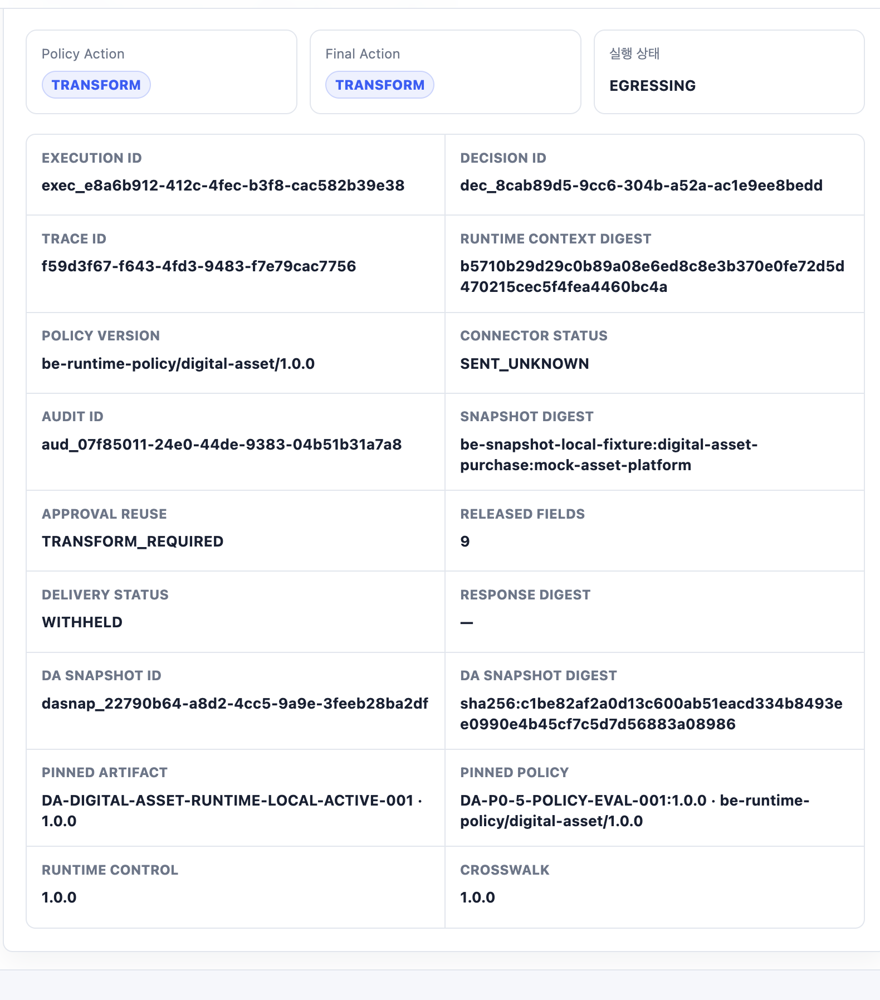
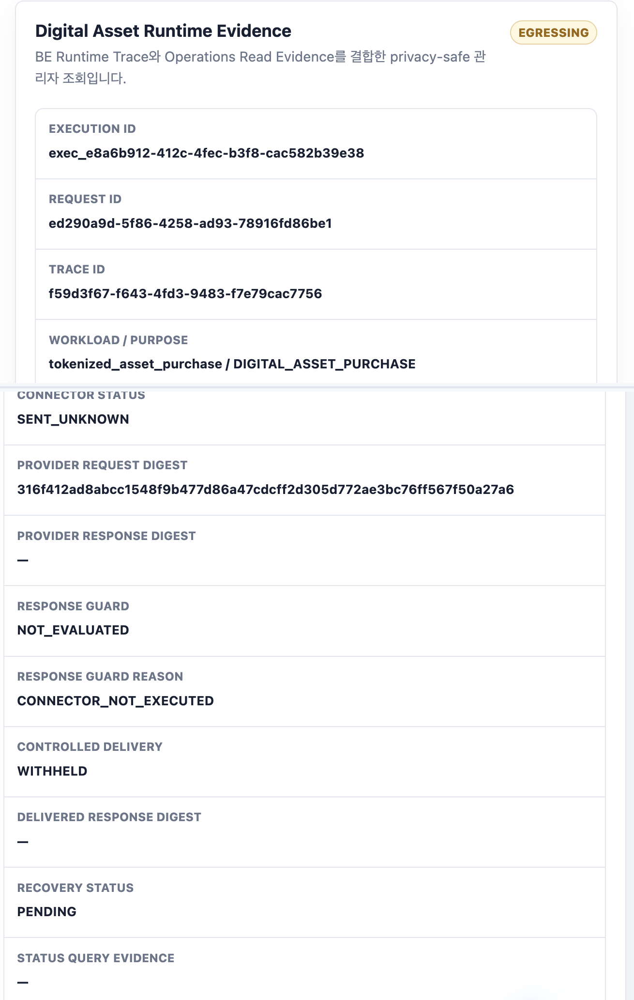

# FPG SENT_UNKNOWN Portfolio Captures

Digital Asset Gateway Lab의 `SENT_UNKNOWN` 실행과 동일 실행의 Audit Evidence를 포트폴리오용으로 캡처한 자료다.

## Capture identity

- Environment: local synthetic fixture
- Execution ID: `exec_e8a6b912-412c-4fec-b3f8-cac582b39e38`
- Trace ID: `f59d3f67-f643-4fd3-9483-f7e79cac7756`
- Runtime status: `EGRESSING`
- Connector status: `SENT_UNKNOWN`
- Controlled delivery: `WITHHELD`
- Recovery status: `PENDING`
- Policy version: `be-runtime-policy/digital-asset/1.0.0`

## Images

### Gateway Lab execution result

### Audit trace for the same execution

## Capture notes

- 실제 로컬 Docker 서비스의 Chrome UI에서 생성한 합성 실행 결과다.
- 포트폴리오 가독성을 위해 브라우저 chrome과 입력 폼을 제외하고 필요한 Evidence 카드만 crop했다.
- Audit 이미지는 동일 실행의 상단 식별자와 하단 외부 실행·복구 Evidence를 한 이미지로 연결했다.
- API Key, Access Key, Authorization Token, 고객·계좌 원문, Wallet Secret, Provider Credential은 포함하지 않는다.
- Digest, Version, Reason/Status와 같은 privacy-safe 운영 메타데이터만 표시한다.
